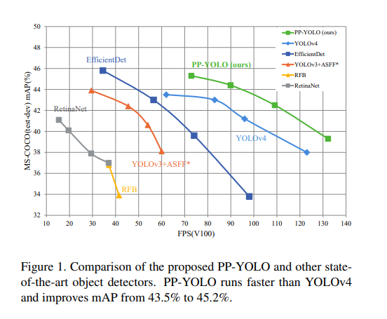
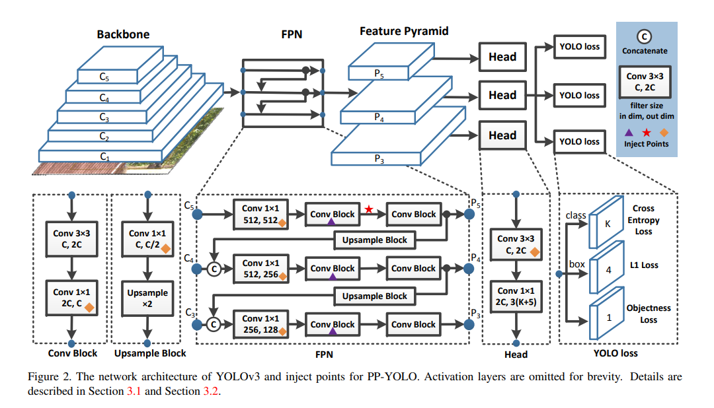
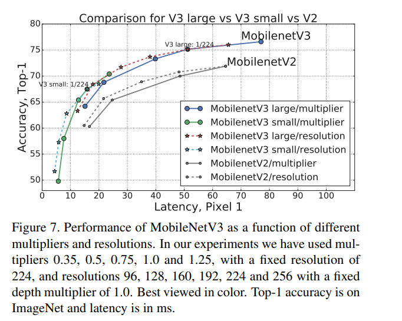
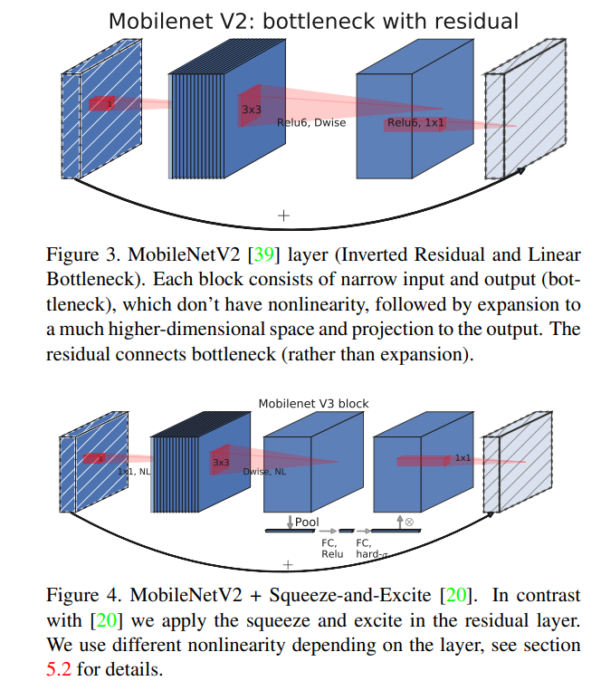
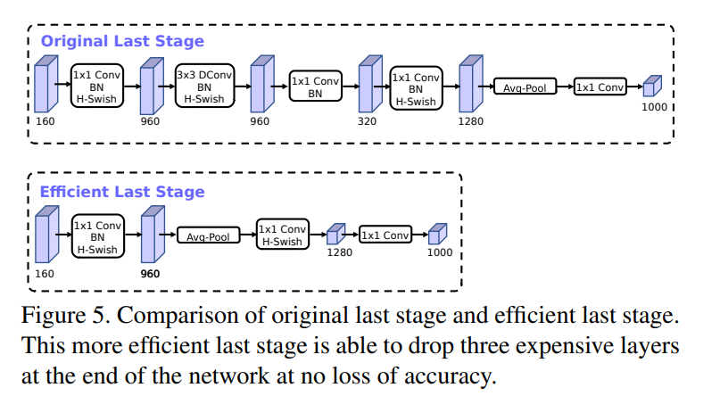

# 实验报告1- 轻量型检测模型的对比实验

> 本次轻量型检测模型的对比实验中，我们小组先从百度飞桨PaddleDetection库中，选取了符合项目未来需求的所有轻量型检测模型进行调参训练，并论文中的模型进行对比。同时，由于百度飞桨平台提供的轻量模型有限，我们还尝试了PaddleDetection库中一些较为轻量的模型，并对比了参数、性能等指标。在PaddleDetection库之外，我们尝试了一些最新的目标检测模型，包括YOLOv8系列模型。
>
> 在训练模型并对比模型后，我们发现Picodet模型在各项指标上均优于论文中的模型；NanoDet、PP-YOLO-Tiny等其他模型在参数量小幅增加的情况下，其性能（mAP）高于论文中所给指标。

[TOC]

模型库范围：

百度飞桨Paddle Detection库：https://github.com/PaddlePaddle/PaddleDetection

百度飞桨Paddle YOLO库：https://github.com/PaddlePaddle/PaddleYOLO

YOLO v8：https://github.com/Rah-xephon/ultralytics

飞桨AI Studio星河社区模型库：https://aistudio.baidu.com/modelsoverview


## 模型性能对比

| 模型(论文)            | 参数量（MB）    | $mAP_{0.5:0.95}(\%)$ | $mAP_{0.5}(\%)$ | 轮次 |
| --------------------- | --------------- | -------------------- | --------------- | ---- |
| yolox-nano            | 0.8971          | 75.77                | 96.7            | 300  |
| yolox-nano(+CSA)      | 0.8983(+0.0012) | 76.4(+0.63)          | 97.0(+0.3)      | 300  |
| yolov4-tiny           | 5.8787          | 68.12                | 96.71           | 300  |
| yolov4-tiny（DP）     | 5.5409(-0.3378) | 65.23(-2.89)         | 94.35(-2.36)    | 300  |
| yolov4-tiny（DP+CSA） | 5.5413(-0.3374) | 65.42(-2.70)         | 94.67(-2.04)    | 300  |

| 模型                      | 参数量（MB） | $mAP_{0.5:0.95}(\%)$ | $mAP_{0.5}(\%)$ | 轮次 | FPS     | 硬件               |
| ------------------------- | ------------ | -------------------- | --------------- | ---- | ------- | ------------------ |
| Picodet-xs                | 0.674        | 82.1                 | 97.3            | 450  | 86.260  | GPU:RTX3060 laptop |
| NanoDet                   | 0.950        | 78.4                 | 97.7            | 130  | 97.752  | CPU:Intel-i9-32核  |
| PP-YOLO-Tiny              | 0.997        | 59.7                 | 91.0            | 90   | 119.670 | GPU:RTX3060 laptop |
| Picodet-s                 | 1.157        | 80.4                 | 97.3            | 200  | 137.482 | GPU:Tesla V100     |
| PP-YOLO_MobileNetV3_small | 2.542        | 58                   | 89.8            | 300  | 129.639 | GPU:Tesla V100     |
| YOLOv8n                   | 3.200        | 98.8                 | 99.0            | 150  | 344.828 | GPU:RTX4060 laptop |
| YOLOX-cdn-tiny            | 5.010        | 56.4                 | 90.9            | 100  | 78.860  | GPU:Tesla V100     |
| YOLOX-tiny                | 5.033        | 54.8                 | 89.0            | 100  | 58.857  | GPU:Tesla V100     |
| PP-ShiTuv2-det            | 7.045        | 76.3                 | 90.4            | 100  | 43.256  | GPU:Tesla V100     |
| PP-YOLOE_plus_crn_s       | 7.619        | 88                   | 98.8            | 100  | 21.950  | GPU:RTX3060 laptop |
| PP-YOLOE_crn_s            | 7.619        | 73.3                 | 92.2            | 100  | 52.122  | GPU:Tesla V100     |
| RT-DETR_HGNetV2_I         | 32.812       | 78.7                 | 91.3            | 100  | 45.228  | GPU:Tesla V100     |
| PP-YOLOE_plus_crn_l       | 53.147       | 85.8                 | 97.1            | 10   | 31.770  | GPU:RTX3060 laptop |
| PP-YOLOE                  | 53.147       | 55.4                 | 91.6            | 100  | 37.349  | GPU:Tesla V100     |
| PP-YOLOv2                 | 54.165       | 72.3                 | 94.4            | 100  | 37.288  | GPU:Tesla V100     |


https://github.com/Megvii-BaseDetection/YOLOX

[PaddleDetection模型库](https://gitee.com/PaddlePaddle/PaddleDetection/blob/release/2.6/README_cn.md#模型库)

[PaddleDetection模型性能对比](https://gitee.com/PaddlePaddle/PaddleDetection/blob/release/2.6/README_cn.md#️模型性能对比)


#### 🖥️服务器端模型性能对比

各模型结构和骨干网络的代表模型在COCO数据集上精度mAP和单卡Tesla V100上预测速度(FPS)对比图。

[](https://user-images.githubusercontent.com/61035602/206434766-caaa781b-b922-481f-af09-15faac9ed33b.png)

#### ⌚️移动端模型性能对比

各移动端模型在COCO数据集上精度mAP和高通骁龙865处理器上预测速度(FPS)对比图。

[](https://user-images.githubusercontent.com/61035602/206434741-10460690-8fc3-4084-a11a-16fe4ce2fc85.png)

[PaddleDetection安装文档](https://gitee.com/PaddlePaddle/PaddleDetection/blob/release/2.6/docs/tutorials/INSTALL_cn.md)

[PaddleDetection目标检测数据准备](https://gitee.com/PaddlePaddle/PaddleDetection/blob/release/2.6/docs/tutorials/data/PrepareDetDataSet.md)


## 模型的相关基础知识

- **目标检测任务**


### PP-PicoDet

[ PP-PicoDet](https://gitee.com/paddlepaddle/PaddleDetection/blob/release/2.6/configs/picodet/README.md)

- 发布全新系列PP-PicoDet模型：**（2022.03.20）**
  - (1)引入TAL及ETA Head，优化PAN等结构，精度提升2个点以上；
  - (2)优化CPU端预测速度，同时训练速度提升一倍；
  - (3)导出模型将后处理包含在网络中，预测直接输出box结果，无需二次开发，迁移成本更低，端到端预测速度提升10%-20%。

PP-PicoDet模型有如下特点：

- 🌟 更高的mAP: 第一个在1M参数量之内`mAP(0.5:0.95)`超越**30+**(输入416像素时)。
- 🚀 更快的预测速度: 网络预测在ARM CPU下可达150FPS。
- 😊 部署友好: 支持PaddleLite/MNN/NCNN/OpenVINO等预测库，支持转出ONNX，提供了C++/Python/Android的demo。
- 😍 先进的算法: 我们在现有SOTA算法中进行了创新, 包括：ESNet, CSP-PAN, SimOTA等等。

模型类型:**Anchor-Free检测器**


#### PP-PicoDet算法特色


#### PP-PicoDet算法性能


#### PP-PicoDet算法结构


论文：[[2111.00902] PP-PicoDet: A Better Real-Time Object Detector on Mobile Devices (arxiv.org)](https://arxiv.org/abs/2111.00902)


- PP-PicoDet算法——Backbone


- PP-PicoDet算法——CSP-PAN


- PP-PicoDet算法——SimOTA


- PP-PicoDet算法——NAS


- PP-PicoDet算法——其他优化


### NanoDet

官方中文知乎模型介绍：[YOLO之外的另一选择，手机端97FPS的Anchor-Free目标检测模型NanoDet现已开源~ - 知乎 (zhihu.com)](https://zhuanlan.zhihu.com/p/306530300)

### PP-YOLOv2

PP-YOLOv2简介：

[PP-YOLOv2](https://arxiv.org/abs/2104.10419)，它是基于[YOLOv3](https://arxiv.org/abs/1804.02767)的优化模型，在尽可能不引入额外计算量的前提下提升模型精度。PP-YOLOv2(R50）在COCO 2017数据集mAP达到49.5%，在 640x640 的输入尺寸下，FPS 达到 68.9FPS，采用 TensorRT 加速，FPS 高达 106.5。PP-YOLOv2（R101）的mAP达到50.3%，对比当前最好的YOLOv5模型，相同的推理速度下，精度提升1.3%；相同精度下，推理速度加速15.9%。本章节重点围绕目标检测任务的优化技巧，并重点解读PP-YOLOv2模型的优化历程。


优化过程：

#### 1. 数据增广

PP-YOLOv2中采用了大量数据增广方式，这里逐一进行说明

###### 1）MixUp

[MixUp](https://github.com/PaddlePaddle/PaddleDetection/blob/release/2.1/ppdet/data/transform/operators.py#L1574)以随机权重对图片和标签进行线性插值，在目标检测任务中标签向量gt_bbox，gt_class，is_crowd等直接连接，gt_score进行加权求和。

以下图为例，将任意两张图片加权叠加作为输入。


###### 2）RandomDistort

[RandomDistort](https://github.com/PaddlePaddle/PaddleDetection/blob/release/2.1/ppdet/data/transform/operators.py#L329)操作以一定的概率对图像进行随机像素内容变换，包括色相（hue），饱和度（saturation），对比度（contrast），明亮度（brightness）。

###### 3）RandomExpand

[随机扩展](https://github.com/PaddlePaddle/PaddleDetection/blob/release/2.1/ppdet/data/transform/operators.py#L875)（RandomExpand）图像的操作步骤如下：

·    随机选取扩张比例（扩张比例大于1时才进行扩张）。

·    计算扩张后图像大小。

·    初始化像素值为输入填充值的图像，并将原图像随机粘贴于该图像上。

·    根据原图像粘贴位置换算出扩张后真实标注框的位置坐标。

###### 4）RandomCrop

[随机裁剪](https://github.com/PaddlePaddle/PaddleDetection/blob/release/2.1/ppdet/data/transform/operators.py#L1182)（RandomCrop）图像的操作步骤如下：

·    若allow_no_crop为True，则在thresholds加入’no_crop’。

·    随机打乱thresholds。

·    遍历thresholds中各元素： (1) 如果当前thresh为’no_crop’，则返回原始图像和标注信息。 (2) 随机取出aspect_ratio和scaling中的值并由此计算出候选裁剪区域的高、宽、起始点。 (3) 计算真实标注框与候选裁剪区域IoU，若全部真实标注框的IoU都小于thresh，则继续第（3）步。 (4) 如果cover_all_box为True且存在真实标注框的IoU小于thresh，则继续第（3）步。 (5) 筛选出位于候选裁剪区域内的真实标注框，若有效框的个数为0，则继续第（3）步，否则进行第（4）步。

·    换算有效真值标注框相对候选裁剪区域的位置坐标。

###### 5）RandomFlip

[随机翻转](https://github.com/PaddlePaddle/PaddleDetection/blob/release/2.1/ppdet/data/transform/operators.py#L487)（RandomFlip）操作利用随机值决定是否对图像，真实标注框位置进行翻转。

以上数据增广方式均在[ppyolov2_reader.yml](https://github.com/PaddlePaddle/PaddleDetection/blob/release/2.1/configs/ppyolo/_base_/ppyolov2_reader.yml#L5)进行配置

##### 2. 骨干网络

PP-YOLOv2不同于YOLOv3的DarkNet53骨干网络，PP-YOLOv2使用更加优异的ResNet50vd-DCN作为模型的骨干网络。它可以被分为ResNet50vd和DCN两部分来看。ResNet50vd是指拥有50个卷积层的ResNet-D网络。ResNet结构如下图所示：


ResNet系列模型在2015年提出后，其模型结构不断被业界开发者持续改进，在经过了B、C、D三个版本的改进后，最新的ResNetvd结构能在基本不增加计算量的情况下显著提高模型精度。ResNetvd的第一个卷积层由三个卷积构成，卷积核尺寸均是3x3，步长分别为2，1，1，取代了上图的7x7卷积，在参数量基本不变的情况下增加网络深度。同时，ResNet-D在ResNet-B的基础上，在下采样模块加入了步长为2的2x2平均池化层，并将之后的卷积步长修改为1，避免了输入信息被忽略的情况。B、C、D三种结构的演化如下图所示：


ResNetvd下采样模块代码参考实现：[代码链接](https://github.com/PaddlePaddle/PaddleDetection/blob/release/2.1/ppdet/modeling/backbones/resnet.py#L265)

ResNetvd使用方式参考[ResNetvd配置](https://github.com/PaddlePaddle/PaddleDetection/blob/release/2.1/configs/ppyolo/_base_/ppyolov2_r50vd_dcn.yml#L13)

```
ResNet:
  depth: 50              # ResNet网络深度
  variant: d             # ResNet变种结构，d即表示ResNetvd
  return_idx: [1, 2, 3]  # 骨干网络引出feature map层级
  dcn_v2_stages: [3]     # 引入可变形卷积层级
  freeze_at: -1          # 不更新参数的层级
  freeze_norm: false     # 是否不更新归一化层
  norm_decay: 0.         # 归一化层对应的正则化系数
```

经多次实验发现，使用ResNet50vd结构作为骨干网络，相比于原始的ResNet，可以提高1%-2%的目标检测精度，且推理速度基本保持不变。而DCN（Deformable Convolution）可变形卷积的特点在于：其卷积核在每一个元素上额外增加了一个可学习的偏移参数。这样的卷积核在学习过程中可以调整卷积的感受野，从而能够更好的提取图像特征，以达到提升目标检测精度的目的。但它会在一定程度上引入额外的计算开销。经过多翻尝试，发现只在ResNet的最后一个stage增加可变形卷积，是实现引入极少计算量并提升模型精度的最佳策略。

可变形卷积的[代码实现](https://github.com/PaddlePaddle/PaddleDetection/blob/release/2.1/ppdet/modeling/layers.py#L410)如下：

```
self.conv_offset = nn.Conv2D(
    in_channels, 
    3*kernel_size**2,
    kernel_size,
    stride=stride,
    padding=(kernel_size - 1) // 2,
    weight_attr=ParamAttr(initializer=Constant(0.0)),
          bias_attr=offset_bias_attr)
 
self.conv_dcn = DeformConv2D(
    in_channels,
    out_channels,
    kernel_size,
    stride=stride,
    padding=(kernel_size - 1) // 2 * dilation,
    dilation=dilation,
    groups=groups,
    weight_attr=weight_attr,
    bias_attr=False)
```

##### 3. Neck&head结构

PP-YOLOv2模型中使用PAN和SPP结构来强化模型结构的Neck部分。[PAN（Path Aggregation Network）](https://arxiv.org/abs/1803.01534)结构，作为[FPN](https://arxiv.org/abs/1612.03144)的变形之一，通过从上至下和从下到上两条路径来聚合特征信息，达到更好的特征提取效果。具体结构如下图，其中C3, C4, C5为3个不同level的feature，分别对应stride为(8, 16, 32)；其中Detection Block使用CSP connection方式，对应ppdet的[PPYOLODetBlockCSP模块](https://github.com/PaddlePaddle/PaddleDetection/blob/release/2.1/ppdet/modeling/necks/yolo_fpn.py#L359)


SPP在[Spatial Pyramid Pooling in Deep Convolutional Networks for Visual Recognition](https://arxiv.org/pdf/1406.4729.pdf)中提出，可以通过多个不同尺度的池化窗口提取不同尺度的池化特征，然后把特征组合在一起作为输出特征，能有效的增加特征的感受野，是一种广泛应用的特征提取优化方法。PPYOLO-v2中使用三个池化窗口分别是(5, 9, 13)，得到特征通过concat拼接到一起，最后跟一个卷积操作，详见[SPP模快](https://github.com/PaddlePaddle/PaddleDetection/blob/release/2.1/ppdet/modeling/necks/yolo_fpn.py#L114)。SPP会插入到PAN第一组计算的[中间位置](https://github.com/PaddlePaddle/PaddleDetection/blob/release/2.1/ppdet/modeling/necks/yolo_fpn.py#L903)。


除此之外，PP-YOLOv2 Neck部分引入了[Mish](https://arxiv.org/pdf/1908.08681.pdf)激活函数。

Mish的[代码实现](https://github.com/PaddlePaddle/PaddleDetection/blob/release/2.1/ppdet/modeling/ops.py#L43)如下所示：

```
def mish(x):
    return x * paddle.tanh(F.softplus(x))
```

PP-YOLOv2中PAN模块使用方式参考 [neck: PPYOLOPAN](https://github.com/PaddlePaddle/PaddleDetection/blob/release/2.1/configs/ppyolo/_base_/ppyolov2_r50vd_dcn.yml#L9)

```
PPYOLOPAN:
  act: "mish"        # 默认使用mish函数
  conv_block_num: 2  # 每个pan block中使用的conv block个数
  drop_block: true   # 是否采用drop block, 训练策略模块中介绍
  block_size: 3      # DropBlock的size
  keep_prob: 0.9     # DropBlock保留的概率 
  spp: true          # 是否使用spp
```

PP-YOLOv2的Head部分在PAN输出的3个scale的feature上进行预测，PP-YOLOv2采用和[YOLO-v3](https://pjreddie.com/media/files/papers/YOLOv3.pdf)类似的结构，即使用卷积对最后的feature进行编码，最后输出的feature是四维的tensor，分别是[n, c, h, w]对应图像数量、通道数、高和宽。

使用方式参考[yolo_head: YOLOv3Head](https://github.com/PaddlePaddle/PaddleDetection/blob/release/2.1/configs/ppyolo/_base_/ppyolov2_r50vd_dcn.yml#L28)

```
YOLOv3Head:
  # anchors包含9种, 根据anchor_masks的index分为3组，分别对应到不同的scale
  # [6, 7, 8]对应到stride为32的预测特征
  # [3, 4, 5]对应到stride为16的预测特征
  # [0, 1, 2]对应到stride为8的预测特征
  anchors: [[10, 13], [16, 30], [33, 23],
            [30, 61], [62, 45], [59, 119],
            [116, 90], [156, 198], [373, 326]]
  anchor_masks: [[6, 7, 8], [3, 4, 5], [0, 1, 2]]
  loss: YOLOv3Loss      # 采用损失函数类型，详细见损失函数模块
  iou_aware: true       # 是否使用iou_aware
  iou_aware_factor: 0.5 # iou_aware的系数
```

##### 4. 损失函数

PP-YOLOv2使用IoU Loss和IoU Aware Loss提升定位精度。IoU Loss直接优化预测框与真实框的IoU，提升了预测框的质量。IoU Aware Loss则用于监督模型学习预测框与真实框的IoU，学习到的IoU将作为定位置信度参与到NMS的计算当中。

对于目标检测任务，IoU是我们常用评估指标。预测框与真实框的IoU越大，预测框与真实框越接近，预测框的质量越高。基于“所见即所得”的思想，PP-YOLOv2使用IoU Loss直接去优化模型的预测框与真实框的IoU。

IoU Loss的[代码实现](https://github.com/PaddlePaddle/PaddleDetection/blob/release/2.1/ppdet/modeling/losses/iou_loss.py#L56)如下所示：

```
iou = bbox_iou(
    pbox, gbox, giou=self.giou, diou=self.diou, ciou=self.ciou)if self.loss_square:
    loss_iou = 1 - iou * iouelse:
    loss_iou = 1 - iou
 
loss_iou = loss_iou * self.loss_weight
```

PP-YOLOv2增加了一个通道用于学习预测框与真实框的IoU，并使用IoU Aware Loss来监督这一过程。在推理过程中，将这个通道学习的IoU预测值也作为评分的因子之一，能一定程度上避免高IoU预测框被挤掉的情况，从而提升模型的精度。IoU Aware Loss为二分类交叉熵损失函数。

IoU Aware Loss的[代码实现](https://github.com/PaddlePaddle/PaddleDetection/blob/release/2.1/ppdet/modeling/losses/iou_aware_loss.py#L41)如下：

```
iou = bbox_iou(
    pbox, gbox, giou=self.giou, diou=self.diou, ciou=self.ciou)
iou.stop_gradient = True
loss_iou_aware = F.binary_cross_entropy_with_logits(
    ioup, iou, reduction='none')
loss_iou_aware = loss_iou_aware * self.loss_weight
```

##### 5. 后处理优化

在后处理的过程中，PP-YOLOv2采用了Matrix NMS和Grid Sensitive。Matrix NMS为并行化的计算[Soft NMS](https://paddlepedia.readthedocs.io/en/latest/tutorials/computer_vision/object_detection/SoftNMS.html?highlight=Soft NMS)的算法，Grid Sensitive解决了检测框的中心落到网格边线的情况。

Grid Sensitive是YOLOv4引入的优化方法，如下图所示，YOLO系列模型中使用sigmoid函数来预测中心点相对于grid左上角点的偏移量。


然而，当中心点位于grid的边线上时，使用sigmoid函数较难预测。因此，对于预测值加上一个缩放和偏移，保证预测框中心点能够有效的拟合真实框刚好落在网格边线上的情况。

Matrix NMS通过一个矩阵并行运算的方式计算出任意两个框之间的IoU，从而实现并行化的计算Soft NMS，在提升检测精度的同时，避免了推理速度的下降。Matrix NMS的实现在PaddlePaddle框架的[Matrix NMS OP](https://github.com/PaddlePaddle/Paddle/blob/release/2.1/paddle/fluid/operators/detection/matrix_nms_op.cc#L169)中，在PaddleDetection中封装了[Matrix NMS API](https://github.com/PaddlePaddle/PaddleDetection/blob/release/2.1/ppdet/modeling/layers.py#L426)

使用方式参考：[post process: MatrixNMS](https://github.com/PaddlePaddle/PaddleDetection/blob/release/2.1/configs/ppyolo/_base_/ppyolov2_r50vd_dcn.yml#L59)

```
nms:
    name: MatrixNMS       # NMS类型，支持MultiClass NMS和Matrix NMS
    keep_top_k: 100       # NMS输出框的最大个数
    score_threshold: 0.01 # NMS计算前的分数阈值
    post_threshold: 0.01  # NMS计算后的分数阈值
    nms_top_k: -1         # NMS计算前，分数过滤后保留的最大个数
    background_label: -1  # 背景类别
```

##### 6. 训练策略

在训练过程中，PP-YOLOv2使用了Synchronize batch normalization, EMA(Exponential Moving Average，指数滑动平均)和DropBlock和来提升模型的收敛效果以及泛化性能。

BN(Batch Normalization, 批归一化)是训练卷积神经网络时常用的归一化方法，能起到加快模型收敛，防止梯度弥散的效果。在BN的计算过程中，需要统计样本的均值和方差，通常batch size越大，统计得到的均值和方差越准确。在多卡训练时，样本被等分送入每张卡，如果使用BN进行归一化，每张卡会利用自身的样本分别计算一个均值和方差进行批处理化，而SyncBN会同步所有卡的样本信息统一计算一个均值和方差，每张卡利用这个均值和方差进行批处理化。因此，使用SyncBN替代BN，能够使计算得到的均值和方差更加准确，从而提升模型的性能。SyncBN的[代码实现](https://github.com/PaddlePaddle/PaddleDetection/blob/release/2.1/ppdet/modeling/backbones/resnet.py#L104)如下所示：

```
if norm_type == 'sync_bn':
    self.norm = nn.SyncBatchNorm(
        ch_out, weight_attr=param_attr, bias_attr=bias_attr)else:
    self.norm = nn.BatchNorm(
        ch_out,
        act=None,
        param_attr=param_attr,
        bias_attr=bias_attr,
        use_global_stats=global_stats)
```

使用方法参考：[SyncBN](https://github.com/PaddlePaddle/PaddleDetection/blob/release/2.1/configs/ppyolo/_base_/ppyolov2_r50vd_dcn.yml#L3)

```
norm_type: sync_bn
```

EMA是指将参数过去一段时间的均值作为新的参数。相比直接对参数进行更新，采用滑动平均的方式能让参数学习过程中变得更加平缓，能有效避免异常值对参数更新的影响，提升模型训练的收敛效果。

EMA的[代码实现](https://github.com/PaddlePaddle/PaddleDetection/blob/release/2.1/ppdet/optimizer.py#L261)如下所示：

```
def update(self, model):
    if self.use_thres_step:
        decay = min(self.decay, (1 + self.step) / (10 + self.step))
    else:
        decay = self.decay
    self._decay = decay
    model_dict = model.state_dict()
    for k, v in self.state_dict.items():
        v = decay * v + (1 - decay) * model_dict[k]
        v.stop_gradient = True
        self.state_dict[k] = v
    self.step += 1
def apply(self):
    if self.step == 0:
        return self.state_dict
    state_dict = dict()
    for k, v in self.state_dict.items():
        v = v / (1 - self._decay**self.step)
        v.stop_gradient = True
        state_dict[k] = v
    return state_dict
```

使用方式参考：[EMA](https://github.com/PaddlePaddle/PaddleDetection/blob/release/2.1/configs/ppyolo/_base_/ppyolov2_r50vd_dcn.yml#L4)

```
use_ema: trueema_decay: 0.9998
```

与[Dropout](https://paddlepedia.readthedocs.io/en/latest/tutorials/deep_learning/model_tuning/regularization/dropout.html?highlight=Dropout)类似，DropBlock是一种防止过拟合的方法。因为卷积特征图的相邻点之间包含密切相关的语义信息，以特征点的形式随机Drop对于目标检测任务通常不太有效。基于此，DropBlock算法在Drop特征的时候不是以特征点的形式来Drop的，而是会集中Drop掉某一块区域，从而更适合被应用到目标检测任务中来提高网络的泛化能力，如下图(c)中所示。


DropBlock的[代码实现](https://github.com/PaddlePaddle/PaddleDetection/blob/release/2.1/ppdet/modeling/necks/yolo_fpn.py#L196)如下所示：

```
gamma = (1. - self.keep_prob) / (self.block_size**2)if self.data_format == 'NCHW':
    shape = x.shape[2:]else:
    shape = x.shape[1:3]for s in shape:
    gamma *= s / (s - self.block_size + 1)
 
matrix = paddle.cast(paddle.rand(x.shape, x.dtype) < gamma, x.dtype)
mask_inv = F.max_pool2d(
            matrix,
            self.block_size,
            stride=1,
            padding=self.block_size // 2,
            data_format=self.data_format)
mask = 1. - mask_inv
y = x * mask * (mask.numel() / mask.sum())
```

以上是PP-YOLOv2模型优化的全部技巧，期间也实验过大量没有正向效果的方法，这些方法可能并不适用于YOLO系列的模型结构或者训练策略，在[PP-YOLOv2](https://arxiv.org/abs/2104.10419)论文中汇总了一部分，这里不详细展开了。下面分享PP-YOLOv2在实际应用中的使用技巧和模型调优经验。

### PP-YOLO_MobileNetV3

#### PP-YOLO

论文：https://arxiv.org/abs/2007.12099

https://blog.csdn.net/qq_41375609/article/details/116375385

45.2% mAP，速度高达72.9 FPS，FPS和mAP均超越YOLOv4，FPS也远超过EfficientDet。

[yolov4](https://so.csdn.net/so/search?q=yolov4&spm=1001.2101.3001.7020)，5模型是基于yolo3算法改进得来。但PPYOLO并不像yolov4探究各种复杂的backbone和数据增广手段，也不是靠nas暴力搜索得到一个结构。在resnet骨干网络系列，数据增广仅靠mixup的条件下，通过合理的tricks组合，不断提升模型性能。

**PP-YOLOv2：** 在同等速度下，精度超越 YOLOv5。相较于 PP-YOLO，v2 版本在 COCO 2017 test-dev 上的精度提升了 3.6%，由 45.9% 提升到了 49.5%；在 640*640 的输入尺寸下，FPS 达到 68.9FPS，而采用 TensorRT 加速的话，FPS 达到了 106.5。这样的性能，超越了当前所有同等计算量下的检测器，包括 YOLOv4-CSP 和 YOLOv5l ，如果将骨架网络从 ResNet50 更换为 ResNet101，PP-YOLOv2 的优势则更为显著：mAP 达到 50.3%，速度比同计算量的 YOLOv5x 高出了 15.9%。



**BackBone骨干网络**

yolov3使用的是较为大型的darknet53，考虑到resnet更广泛的应用以及多样化的分支，选用ResNet50-vd作为整个架构，并将部分卷积层替换成可变形卷积，适当增加了网络复杂度。由于DCN会带来额外的推理时间，仅仅在最后一层的3x3卷积替换成DCN卷积

**DetectionNeck**

这里依然采取的是FPN特征金字塔结构做一个特征融合，类似Yolo3,选取最后三个卷积层C3, C4, C5，然后经过FPN结构，将高层级语义信息和低层级信息进行融合。

**DetectionHead**

原始yolo3的检测头是一个非常简单的结构，通过3x3卷积并最后用1x1卷积调整到自己所需要的通道数目。输出通道数为3(K+5)，3代表每个层设定的三种尺寸的锚框，K代表类别数目，5又可以分成4+1，分别是目标框的4个参数，以及1个参数来判断框里是否有物体。




#### MobileNetV3

论文：https://arxiv.org/abs/1905.02244

https://zhuanlan.zhihu.com/p/665999494

**改进点：**

MobileNetV3 由 google 团队在 2019 年提出的

相比于 MobileNetV2 ，在 ImageNet 分类任务中正确率上升了 3.2%，计算延时降低了 20%



**更新 BlocK**



注意力机制：针对每一个 channel 进行池化处理，得到了 channel 个数个元素，通过两个全连接层，得到输出的这个向量。第一个全连接层的节点个数等于 channel 个数的 1/4，然后第二个全连接层的节点就和 channel 保持一致。这个得到的输出就相当于对原始的特征矩阵的每个 channel 分析出来了其重要程度，越重要的赋予越大的权重，越不重要的就赋予越小的权重。


**耗时层结构**

首先是针对第一层卷积层，因为卷积核比较大，所以将第一层卷积核个数从 32 减少到 16。作者通过实验发现，这样做其实准确率并没有改变，但是参数量小了呀，有节省大概 2ms 的时间。

第二个则是精简 Last Stage。作者在使用过程中发现原始的最后结构比较耗时。精简之后第一个卷积没有变化，紧接着直接进行平均池化操作，再跟两个卷积层。和原来比起来明显少了很多层结构。作者通过实验发现这样做正确率基本没有损失，但是速度快了很多，节省了 7ms 的推理时间，别看 7ms 少，它占据了全部推理时间的 11%。




### YOLOX

论文：https://arxiv.org/abs/2107.08430

https://blog.csdn.net/m0_64384233/article/details/130046457

YOLOX依据YOLOv3和YOLOv5，使用了CSPNet，SiLU激活函数以及PANet，并遵循缩放规则设计了YOLOX-S/M/L/X等四种模型。

此次以YOLOX-S模型为介绍，YOLOX-S模型参数量少，对实时性要求较高，适配度更优，与YOLOX-Nano等模型相比，YOLOX-S模型保有一定的模型体量，具有较高的检测精确率。


**解耦头** 

YOLOX的解耦头（Decoupled head）与以往的YOLO不同，它包含一个1*1的卷积层以调整通道数量，之后是两个并行分支，每个分支上包含两个卷积层，两条分支分别用于分类和回归任务，计算重叠度分支被添加在回归分支上。

**Focus网络结构**
YOLOX使用了Focus网络结构，这个网络结构是在YoloV5里面使用到比较有趣的网络结构，具体操作是在一张图片中每隔一个像素拿到一个值，这个时候获得了四个独立的特征层，然后将四个独立的特征层进行堆叠，此时宽高信息就集中到了通道信息，输入通道扩充了四倍。拼接起来的特征层相对于原先的三通道变成了十二个通道。

**BaseConv**

YOLOX网络中的基本卷积，它包括Conv、BN、SiLu，卷积操作在网络中主要负责特征提取，是模型最重要的操作之一。

**Yolo Head**

Yolo Head通过CSPDarknet和FPN，可以获得三个加强过的有效特征层。每一个特征层都有宽、高和通道数，此时我们可以将特征图看作一个又一个特征点的集合，每一个特征点都有通道数个特征。
Yolo Head实际上所做的工作就是对特征点进行判断，判断特征点是否有物体与其对应。利用FPN特征金字塔，我们可以获得三个加强特征，这三个加强特征的shape分别为(20,20,1024)、(40,40,512)、(80,80,256)，然后我们利用这三个shape的特征层传入Yolo Head获得预测结果。


### PP-YOLO-Tiny

[ PP-YOLO tiny](https://gitee.com/paddlepaddle/PaddleDetection/tree/release/2.6/configs/ppyolo#pp-yolo-tiny模型)

[PP-YOLO](https://gitee.com/link?target=https%3A%2F%2Farxiv.org%2Fabs%2F2007.12099)是PaddleDetection优化和改进的YOLOv3的模型，其精度(COCO数据集mAP)和推理速度均优于[YOLOv4](https://gitee.com/link?target=https%3A%2F%2Farxiv.org%2Fabs%2F2004.10934)模型，要求使用PaddlePaddle 2.0.2(可使用pip安装) 或适当的[develop版本](https://gitee.com/link?target=https%3A%2F%2Fwww.paddlepaddle.org.cn%2Fdocumentation%2Fdocs%2Fzh%2Fdevelop%2Finstall%2FTables.html%23whl-develop)。

PP-YOLO在[COCO](https://gitee.com/link?target=http%3A%2F%2Fcocodataset.org) test-dev2017数据集上精度达到45.9%，在单卡V100上FP32推理速度为72.9 FPS, V100上开启TensorRT下FP16推理速度为155.6 FPS。


[1.3M超轻量PP-YOLO Tiny](https://cloud.tencent.com/developer/article/1820842)

[PP-YOLO Tiny](https://blog.csdn.net/qq_41375609/article/details/116375385)

模型类型: **单阶段Anchor-Based检测器**

**1.3M 超轻量 目标检测算法**

在当前移动互联网、物联网、车联网等行业迅猛发展的背景下，边缘设备上直接部署目标检测的需求越来越旺盛。生产线上往往需要在极低硬件成本的硬件例如树莓派、FPGA、K210 等芯片上部署目标检测算法。而我们常用的手机 App，也很难直接在终端采用超过 6M 的深度学习算法。

得益于 PaddleSlim 飞桨[模型压缩](https://cloud.tencent.com/solution/pointcloud-cmp?from_column=20065&from=20065)工具的能力，**体积仅为 1.3M 的 PP-YOLO Tiny 诞生了！**

**精度速度数据**


首先，PP-YOLO Tiny 沿用了 PP-YOLO 系列模型的 spp，iou loss, drop block, mixup, sync bn 等优化方法，并进一步采用了近 10 种针对移动端的优化策略：

**1、更适用于移动端的骨干网络：**

骨干网络可以说是一个模型的核心组成部分，对网络的性能、体积影响巨大。PP-YOLO Tiny 采用了移动端高性价比骨干网络MobileNetV3。

**2、更适用移动端的检测头（head）：**

除了骨干网络，PP-YOLO Tiny 的检测头（head）部分采用了更适用于移动端的深度可分离卷积（Depthwise Separable Convolution），相比常规的卷积操作，有更少的参数量和运算成本, 更适用于移动端的内存空间和算力。

**3、去除对模型体积、速度有显著影响的优化策略：**

在 PP-YOLO 中，采用了近 10 种优化策略，但并不是每一种都适用于移动端轻量化网络，比如 iou aware 和 matrix nms 等。这类 Trick 在[服务器](https://cloud.tencent.com/act/pro/promotion-cvm?from_column=20065&from=20065)端容易计算，但在移动端会引入很多额外的时延，对移动端来说性价比不高，因此去掉反而更适当。

**4、使用更小的输入尺寸**

为了在移动端有更好的性能，PP-YOLO Tiny 采用 320 和 416 这两种更小的输入图像尺寸。并在 PaddleDetection2.0 中提供 tools/anchor_cluster.py 脚本，使用户可以一键式的获得与目标数据集匹配的 Anchor。例如，在 COCO 数据集上，我们使用 320*320 尺度重新聚类了 anchor，并对应的在训练过程中把每 batch 图⽚的缩放范围调整到 192-512 来适配⼩尺⼨输⼊图片的训练，得到更高性能。

**5、召回率优化**

在使⽤⼩尺寸输入图片时，对应的目标尺寸也会被缩⼩，漏检的概率会变大，对应的采用了如下两种方法来提升目标的召回率：

a.原真实框的注册方法是注册到网格⾥最匹配的 anchor 上，优化后还会同时注册到所有与该真实框的 IoU 不小于 0.25 的 anchor 上，提⾼了真实框注册的正例。

b.原来所有与真实框 IoU 小于 0.7 的 anchor 会被当错负例，优化后将该阈值减小到 0.5，降低了负例比例。

通过以上增加正例、减少负例的方法，弥补了在小尺寸上的正负例倾斜问题，提高了召回率。

**6、更大的 batch size**

往往更大的 Batch Size 可以使训练更加稳定，获取更优的结果。在 PP-YOLO Tiny 的训练中，单卡 batch size 由 24 提升到了 32，8 卡总 batch size=8*32=256，最终得到在 COCO 数据集上体积 4.3M，精度与预测速度都较为理想的模型。

**7、量化后压缩**

最后，结合 Paddle Inference 和 Paddle Lite 预测库支持的后量化策略，即在将权重保存成量化后的 int8 数据。这样的操作，是模型体积直接压缩到了 1.3M，而预测时使用 Paddle Lite 加载权重，会将 int8 数据还原回 float32 权重，所以对精度和预测速度⼏乎没有任何影响。

通过以上一系列优化，我们就得到了 1.3M 超轻量的 PP-YOLO tiny 模型，而算法可以通过 Paddle Lite 直接部署在麒麟 990 等轻量化芯片上，预测效果也非常理想。


### PP-YOLOE+

[PP-YOLOE+](https://gitee.com/paddlepaddle/PaddleDetection/blob/release/2.6/configs/ppyoloe/README_cn.md#模型库)

#### **PP-YOLOE算法概览**


##### **PP-YOLOE详解 — Backbone & Neck**


##### **PP-YOLOE详解 — ET-Head**


##### **PP-YOLOE详解 — Assigner**


##### **PP-YOLOE详解 — Loss**


##### **PP-YOLOE总结**


#### **PP-YOLOE+**


##### **PP-YOLOE+：模型**


##### **PP-YOLOE+：预训练**


##### **PP-YOLOE+：训练**


##### **PP-YOLOE+：部署优化**


### Yolov8n

##### Yolo系列简史：

[YOLO](https://arxiv.org/abs/1506.02640) (You Only Look Once)，由华盛顿大学的Joseph Redmon和Ali Farhadi开发的流行目标检测和图像分割模型，于2015年推出，由于其高速和准确性而迅速流行。

- [YOLOv2](https://arxiv.org/abs/1612.08242) 在2016年发布，通过引入批量归一化、锚框和维度聚类来改进了原始模型。
- [YOLOv3](https://pjreddie.com/media/files/papers/YOLOv3.pdf) 在2018年推出，进一步增强了模型的性能，使用了更高效的主干网络、多个锚点和空间金字塔池化。
- [YOLOv4](https://arxiv.org/abs/2004.10934) 在2020年发布，引入了Mosaic数据增强、新的无锚检测头和新的损失函数等创新功能。
- [YOLOv5](https://github.com/ultralytics/yolov5) 进一步改进了模型的性能，并增加了新功能，如超参数优化、集成实验跟踪和自动导出到常用的导出格式。
- [YOLOv6](https://github.com/meituan/YOLOv6) 在2022年由[美团](https://about.meituan.com/)开源，现在正在该公司的许多自动送货机器人中使用。
- [YOLOv7](https://github.com/WongKinYiu/yolov7) 在COCO关键点数据集上添加了额外的任务，如姿态估计。
- [YOLOv8](https://github.com/ultralytics/ultralytics) 是Ultralytics的YOLO的最新版本。作为一种前沿、最先进(SOTA)的模型，YOLOv8在之前版本的成功基础上引入了新功能和改进，以提高性能、灵活性和效率。YOLOv8支持全范围的视觉AI任务，包括[检测](https://docs.ultralytics.com/tasks/detect/), [分割](https://docs.ultralytics.com/tasks/segment/), [姿态估计](https://docs.ultralytics.com/tasks/pose/), [跟踪](https://docs.ultralytics.com/modes/track/), 和[分类](https://docs.ultralytics.com/tasks/classify/)。这种多功能性使用户能够利用YOLOv8的功能应对多种应用和领域的需求。

##### YOLOv8:

YOLOv3之前的所有YOLO对象检测模型都是用C语言编写的，并使用了Darknet框架，Ultralytics发布了第一个使用PyTorch框架实现的YOLO (YOLOv3)；YOLOv3之后，Ultralytics发布了YOLOv5，在2023年1月，Ultralytics发布了YOLOv8，包含五个模型，用于检测、分割和分类。 YOLOv8 Nano是其中最快和最小的，而YOLOv8 Extra Large (YOLOv8x)是其中最准确但最慢的。

YOLOv8的本质上是Ultralytics在YOLOv5等之前的系列的基础上的进一步的模块组合和改良：

1. 提供了一个全新的SOTA模型（state-of-the-art model），包括 P5 640 和 P6 1280 分辨率的目标检测网络和基于[YOLACT](https://link.zhihu.com/?target=https%3A//arxiv.org/abs/1904.02689)的实例分割模型。和 YOLOv5 一样，基于缩放系数也提供了 N/S/M/L/X 尺度的不同大小模型，用于满足不同场景需求
2. 骨干网络和 Neck 部分可能参考了 YOLOv7 ELAN 设计思想，将 YOLOv5 的 C3 结构换成了梯度流更丰富的 C2f 结构，并对不同尺度模型调整了不同的通道数，属于对模型结构精心微调，不再是一套参数应用所有模型，大幅提升了模型性能。
3. Head 部分相比 YOLOv5 改动较大，换成了目前主流的**解耦头结构**，将**分类和检测头分离**，同时也从Anchor-Based 换成了 Anchor-Free
4. Loss 计算方面采用了TaskAlignedAssigner正样本分配策略，并引入了Distribution Focal Loss
5. 训练的数据增强部分引入了 YOLOX 中的最后 10 epoch 关闭 Mosiac 增强的操作，可以有效地提升精度

在官方给出的对比中，YOLOv8在coco数据集上的效果超过了以往yolo系列的所有模型：


### PP-ShiTuV2-det 

#### 一、模型简介：

PP-ShiTuV2 是基于 PP-ShiTuV1 改进的一个实用轻量级通用图像识别系统，由主体检测、特征提取、向量检索三个模块构成，相比 PP-ShiTuV1 具有更高的识别精度、更强的泛化能力以及相近的推理速度。

其主要针对训练数据集、特征提取两个部分进行优化，使用了更优的骨干网络、损失函数与训练策略，使得 PP-ShiTuV2 在多个实际应用场景上的检索性能有显著提升，同时在CPU端与移动端都具有卓越的表现。

#### 二、模型详解：

参考资料：        ***PP-ShiTu: A Practical Lightweight Image Recognition System  https://arxiv.org/abs/2111.00775***

​					       ***PP-ShiTuV2模型详解	https://blog.csdn.net/m0_63007797/article/details/129616866***


##### 2.1 模型结构

从结构上来看，PP-ShiTu可以分为： 主体检测、特征提取 和 向量检索三个模块。

PP-ShiTuV2 网络结构如下图所示：


##### 2.2 主体检测

主体检测是目前应用非常广泛的一种检测技术，它指的是检测出图片中一个或者多个主体的坐标位置，然后将图像中的对应区域裁剪下来进行识别。主体检测是识别任务的前序步骤，输入图像经过主体检测后再进行识别，可以过滤复杂背景，有效提升识别精度。

考虑到检测速度、模型大小、检测精度等因素， PP-ShiTu 中的主体检测使用的是 PP-PicoDet。


PP-PicoDet 是由 PaddleDetection 开发的一系列新的目标检测模型。具体来说，对于骨干，利用了 PP-LCNet（其网络结构如上所示），这有助于提高检测器的推理速度和 mAP。对于颈部，结合了 一种新的 CSP-PANFPN 结构，有助于提高特征图提取能力。

关于PP-PicoDet模型的详细内容，我们之前已经做了介绍，这里不再重复。

##### 2.3 特征提取

特征提取是图像识别中的关键一环，它的作用是将输入的图片转化为固定维度的特征向量，用于后续的向量检索。

为了图像识别任务的灵活定制，将整个网络分为 Backbone、Neck、Head 和 Loss 部分，整体结构如下图所示：


###### 2.3.1 Backbone

骨干网络不仅对下游模型的性能影响很大，而且模型效率也极大地受此影响，但现有的大多骨干网络在应用中的效率并不理想。

研究人员通过测试现有的主流轻量级模型，最终选择PP-LCNetV2 ，它是在 PP-LCNetV1 基础上，加入了包括 Rep 策略、PW 卷积、Shortcut和激活函数等多个优化点，使得最终分类精度得到提高，且推理延时减少了 40 %。

• Rep 策略：重参数化（Reparameterization）策略是一种优化技术，用于在不影响模型性能的情况下减少计算量。具体说来，对同层的深度可分离卷积（Depthwise Separable Convolution）进行融合，融合操作（如下图所示）是将同层的多个深度可分离卷积合并为一个更大的深度可分离卷积操作，从而减少计算量。


• PW 卷积：深度可分离卷积通常由一层 DW 卷积和一层 PW 卷积组成，用以替换标准卷积.为了使深度可分离卷积具有更强的拟合能力，尝试使用两层 PW 卷积，同时为了控制模型效率不受影响，两层PW 卷积设置为：第一个在通道维度对特征图压缩，第二个再通过放大还原特征图通道。

• ShortCut：在深度学习中，残差结构（residual）是指通过添加一个跳跃连接（shortcut connection）来解决神经网络训练过程中的梯度消失和梯度爆炸问题。在 PP-LCNetV2 中，以 Stage 为单位实验了残差结构对模型的影响，发现残差结构的使用并非一定会带来性能的提高，因此 PP-LCNetV2 仅在**最后一个 Stage 中的使用了残差结构：即在 Block 中增加 Shortcut**。

• 激活函数：在目前的轻量级卷积神经网络中，ReLU、Hard-Swish 激活函数最为常用，虽然在模型性能方面，Hard-Swish 通常更为优秀，然而发现部分推理平台对于 Hard-Swish 激活函数的效率优化并不理想，因此为了兼顾通用性，PP-LCNetV2 默认使用了 ReLU 激活函数，并且测试发现，ReLU 激活函数对于较大模型的性能影响较小。

###### 2.3.2 Neck

Neck 部分采用了 [BN Neck](https://gitee.com/paddlepaddle/PaddleClas/blob/release/2.5/ppcls/arch/gears/bnneck.py)，对 Backbone 抽取得到的特征的每个维度进行标准化操作，减少了同时优化**度量学习损失函数**和**分类损失函数**的难度，加快收敛速度。

具体而言，[BN Neck](https://gitee.com/paddlepaddle/PaddleClas/blob/release/2.5/ppcls/arch/gears/bnneck.py)层会对特征进行平移和缩放操作，使得特征的均值接近0，方差接近1。这样可以使得特征更易于优化，有利于提高模型的泛化能力和准确性。

###### 2.3.3 Head

Head 部分选用 [FC Layer](https://gitee.com/paddlepaddle/PaddleClas/blob/release/2.5/ppcls/arch/gears/fc.py)，使用分类头将 feature 转换成 logits 供后续计算分类损失。

在深度学习中，logits是指模型输出层的原始数值，通常用于表示不同类别的得分或概率。在分类任务中，模型通过计算输入特征的线性变换（使用全连接层）并应用激活函数，将特征映射到logits空间。然后，通过将logits与真实标签进行比较，可以计算出分类损失，用于模型的训练和优化。

###### 2.3.4 Loss

Loss 部分选用 **分类损失**（Cross Entropy Loss）和**基于角度的三元组损失**（Triplet Angular Margin Loss），在训练时以分类损失和基于角度的三元组损失来指导网络进行优化。研究人员基于原始的 TripletLoss (困难三元组损失)进行了改进，将优化目标从 L2 欧几里得空间更换成**余弦空间**，并加入了 锚点样本（anchor）与正样本（positive）以及负样本（negative） 之间的硬性距离约束，让训练与测试的目标更加接近，提升模型的泛化能力。

##### 2.4 向量检索

向量检索技术在图像识别、图像检索中应用比较广泛。其主要目标是对于给定的查询向量，在已经建立好的向量库中进行特征向量的相似度或距离计算，返回候选向量的相似度排序结果。

在 PP-ShiTuV2 识别系统中，使用了 Faiss 向量检索开源库对此部分进行支持，其具有适配性好、安装方便、算法丰富，同时支持 CPU 与GPU 的优点。

PP-ShiTuV2 系统中关于 Faiss 向量检索库的安装及使用可以参考文档：[vector search](https://gitee.com/paddlepaddle/PaddleClas/blob/release/2.5/docs/zh_CN/deployment/PP-ShiTu/vector_search.md)。


### RT-DETR_HGNetV2 

#### 一、模型简介：

RT-DETR 是第一个实时端到端目标检测模型。RT-DETR-L 在 COCO val2017 上实现了 53.0% 的 AP，在 T4 GPU 上实现了 114FPS，RT-DETR-X 实现了 54.8% 的 AP和 74FPS，**在速度和精度方面都优于相同规模的所有 YOLO 检测器**。RT-DETR-R50 实现了 53.1% 的 AP 和 108FPS，RT-DETR-R101 实现了 54.3% 的 AP 和 74FPS，**在精度上超过了全部使用相同骨干网络的 DETR 检测器**。

下图展示了 RT-DETR 模型的测试效果：


#### 二、模型详解：

参考资料：        **DETRs Beat YOLOs on Real-time Object Detection  https://arxiv.org/abs/2304.08069**

​				  	   **《目标检测》-第33章-浅析RT-DETR  https://zhuanlan.zhihu.com/p/626659049 **


##### 2.1 模型架构

从结构上来看，RT-DETR可以分为三大块：**主干网络**、**颈部网络**以及**解码器**。

RT-DETR模型架构如下图所示：


##### 2.2 主干网络

对于主干网络，RT-DETR采用CNN网络，这一设计和DETR是一样的。当然，也可以采用诸如SwinTransformer、ViT等优秀的Transformer网络来作为主干网络，但就其功能而言，没有本质上的差别。

与以往的检测器一样，RT-DETR也是从主干网络中抽取三个尺度的输出，其输出步长分别为8、16和32，在RT-DETR论文中，使用 S3 、 S4 和 S5 进行标记。

##### 2.3 颈部网络

对于颈部网络，RT-DETR采用了一层Transformer的Encoder，用来处理主干网络输出的 S5 特征，即RT-DETR模型架构图中所展示的AIFI（Attention-based Intra-scale Feature Interaction）模块，该模块包含标准的MSAH（或者Deformable Attention）和FFN，如下图所展示的公式，注意，其中省略了FFN的处理。


具体说来，首先，将二维的 S5 特征拉成向量，然后交给AIFI模块处理，其数学过程就是多头自注意力与FFN，随后，再将输出调整回二维，记作 S5 ，以便去完成后续的“跨尺度特征融合”。之所以RT-DETR的AIFI只处理最后的S5 特征，是出于两点考虑：

1. 以往的DETR，如Deformable DETR通过将多尺度的特征进行拉平，然后将它们拼接在一起，构成一个序列较长的向量，尽管这可以使得多尺度之间的特征进行充分的交互，但也会造成极大的计算量和计算耗时。RT-DETR认为这是当前的DETR计算速度慢的主要原因之一；
2. RT-DETR认为相较于较浅的S3 特征和S4 特征，S5 特征拥有更深、更高级、更丰富的语义特征，这些语义特征是Transformer更加感兴趣的和需要的，对于区分不同物体的特征是更加有用的，而浅层特征因缺少较好的语义特征而起不到什么作用。

综上，RT-DETR作者团队认为只需将Encoder作用在S5 特征上，既可以大幅度地减小计算量、提高计算速度，又不会损伤到模型的性能。为了验证这一点，作者团队设计了若干对照组，如下图所示。


通过对比试验，作者证明：

**1）**Transformer的Encoder部分只需要处理high-level特征，既能大幅度削减计算量、提升计算速度，同时也不会损伤到性能，甚至还有所提升；

**2）**对于多尺度特征的交互和融合，仍可以采用CNN架构常用的PAN网络来搭建，只需要一些细节上的调整即可。

##### 2.4 解码器

对于解码器，主要涉及RT-DETR中的**assignment**和**loss**两大部分。关于最终的检测头，或者说解码器，RT-DETR选择了Transformer的Decoder。

具体实现上，RT-DETR选择了DINO的Decoder部分，即所谓的“DINO Head”，使用到了DINO的“去噪思想”来提升双边匹配的样本质量，加快训练的收敛速度。整体来看，RT-DETR的这两部分是继承了DINO的工作，不过，有一个细节上的调整，那就是在assignment阶段和计算loss的阶段，classification的标签都换成了“**IoU软标签**”：

对于“IoU软标签”，就是指将预测框与GT之间的IoU作为类别预测的标签，其本质就是已经被广泛验证了的IoU-aware。在最近的诸多工作里，比如RTMDet、DAMO-YOLO等工作中，都有引入这一理念，即去对齐类别和回归的差异。将IoU作为类别的标签，那么**类别的学习就要受到回归的调制，只有当回归学得也足够好的时候，类别才会学得足够好**，否则，类别不会过快地先学得比回归好，因此后者显式地制约着前者。

除此之外，RT-DETR的Decoder、assignment以及Loss等设置都和DINO一样。其实，DETR系列的精髓就在于“Decoder”部分——通过object query和cross attention的结合，将检测任务转换成一个无序的序列输出，大大改变了检测的范式，这一部分也是DETR系列设计的“难点”。

#### 三、实验对比：

##### 3.1 和实时检测器对比


RT-DETR-L 在 COCO val2017 上的精度为 53.0% AP ，在 T4 GPU 上的 FPS 为 114，RT-DETR-X 的精度为 54.8% AP，FPS 为 74。相同尺度的版本下，RT-DETR 比 YOLO 系列检测器的精度都更高一些，端到端速度都更快一些。

##### 3.2 和端到端检测器对比


RT-DETR-R50 在 COCO val2017 上的精度为 53.1% AP，在 T4 GPU 上的 FPS 为 108，RT-DETR-R101 的精度为 54.3% AP，FPS 为 74。总结来说，RT-DETR 比具有相同 backbone 的 DETR 系列检测器有比较显著的精度提升和速度提升。

#### 四、总结：

在这项研究中，提出了一个实时的端到端检测器 RT-DETR ，克服了 NMS 对实时检测器推理速度的延迟和对精度的影响，对 DETR 的实时化进行了初步的探索和尝试，并提供了一种可行的解决方案。作者认为 RT-DETR 还有很多可以改进的地方，例如在小目标上的性能指标尚不如 YOLO 系列的部分检测器。在今后的研究中还可以继续优化，从而为实时目标检测这一领域提供更优的解决方案，为实际应用带来更好的体验。

## 模型训练及调参的相关流程

### 环境部署

[INSTALL_cn - github](https://github.com/PaddlePaddle/PaddleDetection/blob/release/2.6/docs/tutorials/INSTALL_cn.md)    [INSTALL_cn - Gitee](https://gitee.com/PaddlePaddle/PaddleDetection/blob/release/2.6/docs/tutorials/INSTALL_cn.md)

#### 本地

> Windows11,CUDA11.6,CUDNN8.4.1,WSL2-Ubuntu22.04

[Anaconda](https://www.anaconda.com/) 

[CUDA Toolkit](https://developer.nvidia.com/cuda-toolkit)

[Git](https://git-scm.com/book/zh/v2/起步-安装-Git)

```sh
# 创建conda环境
conda create -n test python==3.9
conda activate test
# 安装对应版本的PaddlePaddle
python -m pip install paddlepaddle-gpu==2.5.2.post116 -f https://www.paddlepaddle.org.cn/whl/windows/mkl/avx/stable.html
```

请确保您的PaddlePaddle安装成功并且版本不低于需求版本。使用以下命令进行验证。

```
# 在您的Python解释器中确认PaddlePaddle安装成功
>>> import paddle
>>> paddle.utils.run_check()

# 确认PaddlePaddle版本
python -c "import paddle; print(paddle.__version__)"
```

**注意**

1. 如果您希望在多卡环境下使用PaddleDetection，请首先安装NCCL

##### 安装PaddleDetection

**注意：** pip安装方式只支持Python3

```shell
# 克隆PaddleDetection仓库
cd <path/to/clone/PaddleDetection>
#git clone https://github.com/PaddlePaddle/PaddleDetection.git
git clone https://gitee.com/PaddlePaddle/PaddleDetection.git

# 安装其他依赖
cd PaddleDetection
pip install -r requirements.txt

# 编译安装paddledet
python setup.py install
```

**注意**

1. 如果github下载代码较慢，可尝试使用[gitee](https://gitee.com/PaddlePaddle/PaddleDetection.git)或者[代理加速](https://gitee.com/link?target=https%3A%2F%2Fdoc.fastgit.org%2Fzh-cn%2Fguide.html)。

2. 若您使用的是Windows系统，由于原版cocoapi不支持Windows，`pycocotools`依赖可能安装失败，可采用第三方实现版本，该版本仅支持Python3

   `pip install git+https://github.com/philferriere/cocoapi.git#subdirectory=PythonAPI`

3. 若您使用的是Python <= 3.6的版本，安装`pycocotools`可能会报错`distutils.errors.DistutilsError: Could not find suitable distribution for Requirement.parse('cython>=0.27.3')`, 您可通过先安装`cython`如`pip install cython`解决该问题

安装后确认测试通过：

```
python ppdet/modeling/tests/test_architectures.py
```

测试通过后会提示如下信息：

```
.......
----------------------------------------------------------------------
Ran 7 tests in 12.816s
OK
```

#### Docker

> 如果您没有Docker运行环境，请参考[Docker官网](https://gitee.com/link?target=https%3A%2F%2Fwww.docker.com%2F)进行安装。如果您没有WSL，请参考[安装 WSL | Microsoft Learn](https://learn.microsoft.com/zh-cn/windows/wsl/install)进行安装。

```sh
# 查看docker版本
docker -v
```

##### 快速上手

使用的Docker环境可以快速上手体验，我们为您提供了CPU和GPU版本的镜像。 如果您是Docker新手，建议您花费几分钟的时间学习下[docker基本用法](https://github.com/PaddlePaddle/PaddleCloud/blob/main/docs/zh_CN/docker-tutorial.md)。

**使用CPU版本的Docker镜像**

```bash
# 拉取镜像
docker pull paddlecloud/paddledetection:2.4-cpu-e9a542
# 进入交互式终端
docker run --name dev -v $PWD:/home/PaddleDetection/output -p 8888:8888 -it paddlecloud/paddledetection:2.4-cpu-e9a542 /bin/bash
# 测试
python tools/infer.py -c configs/ppyolo/ppyolo_r50vd_dcn_1x_coco.yml -o use_gpu=false weights=https://paddledet.bj.bcebos.com/models/ppyolo_r50vd_dcn_1x_coco.pdparams --infer_img=demo/000000014439.jpg

# 推出交互式终端
exit
# 删除容器
docker rm dev
```

**使用GPU版本的Docker镜像**

```bash
docker run --name dev1 --runtime=nvidia -v $PWD:/home/PaddleDetection/output -p 8888:8888 -it paddlecloud/paddledetection:2.4-gpu-cuda11.2-cudnn8-latest /bin/bash

docker run --name dev1 -v $PWD/gpu/:/home/PaddleDetection/output -p 8888:8888 -it paddlecloud/paddledetection:2.4-gpu-cuda11.2-cudnn8-latest /bin/bash

# 测试
python tools/infer.py -c configs/ppyolo/ppyolo_r50vd_dcn_1x_coco.yml -o use_gpu=true weights=https://paddledet.bj.bcebos.com/models/ppyolo_r50vd_dcn_1x_coco.pdparams --infer_img=demo/000000014439.jpg

# 推出交互式终端
exit
# 删除容器
docker rm dev1
```

#### 中科曙光

[容器 (sugon.com)](https://ac.sugon.com/ui/acw/index.html;jsessionid=07A452B0330FE0836895A32B7C6B469D#/container-service/container-instance)

```sh
conda create -n paddle2.3.2-gpu python==3.9
conda activate paddle2.3.2-gpu

# 克隆PaddleDetection仓库
cd ~/Experiment # cd <path/to/clone/PaddleDetection>
git clone https://gitee.com/PaddlePaddle/PaddleDetection.git
# 安装其他依赖
cd PaddleDetection
pip install -r requirements.txt -i https://pypi.tuna.tsinghua.edu.cn/simple/
pip install numba==0.56.4 -i https://pypi.tuna.tsinghua.edu.cn/simple/
# 编译安装paddledet
python setup.py install
```


```sh
conda activate paddle2.3.2-gpu
cd ~/Experiments/PaddleDetection
export CUDA_VISIBLE_DEVICES=0,1,2,3,4,5,6,7
python tools/train.py -c configs/ppyolo/ppyolo_tiny_650e_coco.yml --eval &> ./log/ppyolo_tiny_650e_coco/ppyolo_tiny_650e_coco-test.log 2>&1 &
```


#### AiStudio - BML Codelab

[AI studio(BML Codelab)：PP-YOLO-Tiny](https://aistudio.baidu.com/projectdetail/7105456?contributionType=1)


#### AiStudio - PaddleX

[AI studio(PaddleX)：PP-YOLOE+_crn_l 基础模型](https://aistudio.baidu.com/modelsdetail/33?modelId=33)


### PP-PicoDet

#### 模型训练

[picodet - github](https://github.com/PaddlePaddle/PaddleDetection/blob/release/2.6/configs/picodet/README.md) 	      [picodet - Gitee](https://gitee.com/PaddlePaddle/PaddleDetection/blob/release/2.6/configs/picodet/README.md)

[PrepareDetDataSet - github.com](https://github.com/PaddlePaddle/PaddleDetection/blob/release/2.6/docs/tutorials/data/PrepareDetDataSet.md)      [PrepareDetDataSet - Gitee](https://gitee.com/PaddlePaddle/PaddleDetection/blob/release/2.6/docs/tutorials/data/PrepareDetDataSet.md)

修改configs\picodet\picodet_s_416_coco_lcnet.yml配置

```yml
_BASE_: [
  '../datasets/trash_coco_detection.yml',
  '../runtime.yml',
  '_base_/picodet_v2.yml',
  '_base_/optimizer_300e.yml',
  '_base_/picodet_416_reader.yml',
]

pretrain_weights: https://paddle-imagenet-models-name.bj.bcebos.com/dygraph/legendary_models/PPLCNet_x0_75_pretrained.pdparams
weights: output/picodet_s_416_coco/best_model
find_unused_parameters: True
use_ema: true
epoch: 300
snapshot_epoch: 10
print_params: True

LCNet:
  scale: 0.75
  feature_maps: [3, 4, 5]

LCPAN:
  out_channels: 96

PicoHeadV2:
  conv_feat:
    name: PicoFeat
    feat_in: 96
    feat_out: 96
    num_convs: 2
    num_fpn_stride: 4
    norm_type: bn
    share_cls_reg: True
    use_se: True
  feat_in_chan: 96

TrainReader:
  # batch_size: 48
  batch_size: 24

LearningRate:
  # base_lr: 0.24
  base_lr: 0.06
  schedulers:
  - !CosineDecay
    max_epochs: 300
  - !LinearWarmup
    start_factor: 0.1
    steps: 300

```

创建configs\datasets\trash_coco_detection.yml

```yml
metric: COCO
num_classes: 3

TrainDataset:
  name: COCODataSet
  image_dir: images
  anno_path: annotations/instance_train.json
  dataset_dir: dataset/datasets_coco
  data_fields: ['image', 'gt_bbox', 'gt_class', 'is_crowd']

EvalDataset:
  name: COCODataSet
  image_dir: images
  anno_path: annotations/instance_val.json
  dataset_dir: dataset/datasets_coco
  allow_empty: true

TestDataset:
  name: ImageFolder
  anno_path: annotations/instance_val.json # also support txt (like VOC's label_list.txt)
  dataset_dir: dataset/datasets_coco # if set, anno_path will be 'dataset_dir/anno_path'
```

运行

```sh
python tools/train.py -c configs/picodet/picodet_s_416_coco_lcnet.yml --eval
```

#### 调参

**注意：**如果训练时显存out memory，将TrainReader中batch_size调小，同时LearningRate中base_lr等比例减小。同时我们发布的config均由4卡训练得到，如果改变GPU卡数为1，那么base_lr需要减小4倍。

**学习率设置太大**会导致**训练十分不稳定**，甚至出现Nan，**设置太小**会导致**损失下降太慢**。学习率一般要随着训练进行衰减。衰减时机，可以是验证集准确率不再上升时，或固定训练多少个周期以后自动进行衰减。

**batch size值增加**，能**提高训练速度**。但是有可能**收敛结果变差**。如果显存大小允许，可以考虑从一个比较大的值开始尝试。因为batch size太大，一般不会对结果有太大的影响，而**batch size太小的话**，**结果有可能很差**。


考虑到使用的是单卡GPU，所以我们需要将模型的batch_size和base_lr调小为原来的1/4，同时加上显卡的显存的限制也需要相应地线性调整。这里我们还是采用官方的样例，若是精度不够我们适当地线性调整学习率来使其精度增加。

### NanoDet

##### 参数配置：

1.训练集参数设置：NanoDet支持三种不同的格式：coco、voc和yolo格式，三种格式任选其一即可。

 2.模型训练的参数文件(my_yml.yml)：

```yaml
#Config File example
save_dir: workspace/nanodet_m
model:
  weight_averager:
    name: ExpMovingAverager
    decay: 0.9998
  arch:
    name: NanoDetPlus
    detach_epoch: 10
    backbone:
      name: ShuffleNetV2
      model_size: 1.0x
      out_stages: [2,3,4]
      activation: LeakyReLU
    fpn:
      name: GhostPAN
      in_channels: [116, 232, 464]
      out_channels: 96
      kernel_size: 5
      num_extra_level: 1
      use_depthwise: True
      activation: LeakyReLU
    head:
      name: NanoDetPlusHead
      num_classes: 3
      input_channel: 96
      feat_channels: 96
      stacked_convs: 2
      kernel_size: 5
      strides: [8, 16, 32, 64]
      activation: LeakyReLU
      reg_max: 7
      norm_cfg:
        type: BN
      loss:
        loss_qfl:
          name: QualityFocalLoss
          use_sigmoid: True
          beta: 2.0
          loss_weight: 1.0
        loss_dfl:
          name: DistributionFocalLoss
          loss_weight: 0.25
        loss_bbox:
          name: GIoULoss
          loss_weight: 2.0
    # Auxiliary head, only use in training time.
    aux_head:
      name: SimpleConvHead
      num_classes: 3
      input_channel: 192
      feat_channels: 192
      stacked_convs: 4
      strides: [8, 16, 32, 64]
      activation: LeakyReLU
      reg_max: 7
# 填入自己的类别名称
class_names: &class_names ['garbage', 'overflow', 'garbage_bin']  #Please fill in the category names (not include background category)
# 训练数据集的格式，这里以coco为例，
data:
  train:
    name: XMLDataset
    class_names: *class_names
    img_path: datasets_coco/images  #Please fill in train image path
    ann_path: datasets_coco/annotations  #Please fill in train xml path
    input_size: [320,320] #[w,h]
    keep_ratio: True
    pipeline:
      perspective: 0.0
      scale: [0.6, 1.4]
      stretch: [[1, 1], [1, 1]]
      rotation: 0
      shear: 0
      translate: 0.2
      flip: 0.5
      brightness: 0.2
      contrast: [0.8, 1.2]
      saturation: [0.8, 1.2]
      normalize: [[103.53, 116.28, 123.675], [57.375, 57.12, 58.395]]
  val:
    name: XMLDataset
    class_names: *class_names
    img_path: datasets_coco/images #Please fill in val image path
    ann_path: datasets_coco/annotations #Please fill in val xml path
    input_size: [320,320] #[w,h]
    keep_ratio: True
    pipeline:
      normalize: [[103.53, 116.28, 123.675], [57.375, 57.12, 58.395]]
device:
  gpu_ids: [0] # Set like [0, 1, 2, 3] if you have multi-GPUs
  workers_per_gpu: 8
  batchsize_per_gpu: 96
  precision: 32 # set to 16 to use AMP training
schedule:
#  resume:
#  预训练模型，学习率，衰减系数，最大轮次等参数
  load_model: nanodet_m.ckpt
  optimizer:
    name: AdamW
    lr: 0.0015
    weight_decay: 0.05
  warmup:
    name: linear
    steps: 500
    ratio: 0.0001
  total_epochs: 200
  lr_schedule:
    name: CosineAnnealingLR
    T_max: 200
    eta_min: 0.00005
  val_intervals: 10
grad_clip: 35
evaluator:
  name: CocoDetectionEvaluator
  save_key: mAP

log:
  interval: 10
```

配置好上述文件后，进入正确环境。 python train.py my_yml.yml即可

##### 训练结果：

```txt
Epoch:10
mAP: 0.6298102338432353
AP_50: 0.8883897876025882
AP_75: 0.7160659797522352
AP_small: 0.16902889040031827
AP_m: 0.4904883840419801
AP_l: 0.7234329491873448
Epoch:20
mAP: 0.6855852501579843
AP_50: 0.915683583888699
AP_75: 0.7884194981060553
AP_small: 0.2173580435371421
AP_m: 0.560113782444113
AP_l: 0.7749663630889366
Epoch:30
mAP: 0.7103688289213287
AP_50: 0.9317597123240234
AP_75: 0.8172392055805034
AP_small: 0.2421451916262449
AP_m: 0.5917646557158285
AP_l: 0.7944412569595316
Epoch:40
mAP: 0.7348510860724767
AP_50: 0.9446501741853047
AP_75: 0.8385233644938178
AP_small: 0.27538900174939296
AP_m: 0.6202534680888232
AP_l: 0.8170449282965998
Epoch:50
mAP: 0.7596216015577726
AP_50: 0.9540914578885548
AP_75: 0.8644310883844092
AP_small: 0.29355888211316294
AP_m: 0.6525957741336964
AP_l: 0.8377339795432999
Epoch:60
mAP: 0.7792274094275269
AP_50: 0.9607382385524393
AP_75: 0.8810864039583903
AP_small: 0.32318714275057536
AP_m: 0.6786315169141305
AP_l: 0.8543043192077383
Epoch:70
mAP: 0.7951760333707375
AP_50: 0.9656704449590128
AP_75: 0.896950540147251
AP_small: 0.3394457429634243
AP_m: 0.6991048084412302
AP_l: 0.8679179492775793
Epoch:80
mAP: 0.8098512981521048
AP_50: 0.9701741771503696
AP_75: 0.9064050534603824
AP_small: 0.36279014999206394
AP_m: 0.7183631710080254
AP_l: 0.8803308132042289
Epoch:90
mAP: 0.8218335301870202
AP_50: 0.9722331873782913
AP_75: 0.9184255654053736
AP_small: 0.37878380590068056
AP_m: 0.735900717661391
AP_l: 0.8893981685781502
Epoch:100
mAP: 0.8339451933539141
AP_50: 0.9738925199733754
AP_75: 0.926467094412589
AP_small: 0.39142430217352137
AP_m: 0.749961978159837
AP_l: 0.89965186984731
Epoch:110
mAP: 0.8424352234429529
AP_50: 0.9749522869083471
AP_75: 0.9289255322764332
AP_small: 0.4035261450818794
AP_m: 0.7631520805290463
AP_l: 0.9070214987431412
Epoch:120
mAP: 0.8501426538047531
AP_50: 0.9759156454359691
AP_75: 0.9375013561126349
AP_small: 0.41655869719218513
AP_m: 0.7729934433009907
AP_l: 0.9133926262293671
Epoch:130
mAP: 0.8574990675842804
AP_50: 0.9771131706665012
AP_75: 0.9412220476123596
AP_small: 0.42331153749855505
AP_m: 0.7838499477626321
AP_l: 0.9198225621558475
```

### PP-YOLOv2

https://aistudio.baidu.com/projectdetail/7111704


### PP-YOLO_MobileNetV3

https://aistudio.baidu.com/projectdetail/7097901?contributionType=1


### YOLOX

https://aistudio.baidu.com/projectdetail/7097901?contributionType=1


### PP-YOLO

在实际产业落地项目中，通常需要对自定义采集的数据进行处理，并对数据集的难点进行针对性优化，本节主要汇总了在实际应用场景下，PP-YOLOv2模型的使用方法，包括如何处理自定义数据集和模型调优经验。

#### 1. 自定义数据集

在实际项目应用中，往往需要自己采集数据，在PaddleDetection中支持三种用户自定义数据读取方式：

·    将用户数据转成VOC数据(根据需要仅包含物体检测所必须的标签即可)

·    将用户数据转成COCO数据(根据需要仅包含物体检测所必须的标签即可)

·    自定义一个用户数据的reader(较复杂数据，需要自定义reader)

这里详细说明第二种数据处理方式，其余两种可以参考[数据准备文档](https://github.com/PaddlePaddle/PaddleDetection/blob/release/2.1/docs/tutorials/PrepareDataSet.md)。PaddleDetection在`tools/x2coco.py`中提供了多种数据格式转换至COCO数据格式的脚本，包括VOC数据集格式、labelme标注格式和cityscape数据格式。以labelme数据转换至COCO数据集为例：

```
 
python tools/x2coco.py \
                --dataset_type labelme \              # 指定输入数据类型
                --json_input_dir ./labelme_annos/ \   # 标注文件夹位置
                --image_input_dir ./labelme_imgs/ \   # 图片文件夹位置
                --output_dir ./cocome/ \              # 输出COCO数据所在位置
                --train_proportion 0.8 \              # 训练集占总数据集比例
                --val_proportion 0.2 \                # 验证集占总数据集比例
                --test_proportion 0.0                 # 测试集占总数据集比例
 
```

在执行完以上命令后，即可在`./cocome/`下得到转换为COCO数据格式的自定义数据集，数据目录结构如下（注意数据集中路径名、文件名尽量不要使用中文，避免中文编码问题导致出错）：

```
cocome/
├── annotations
│   ├── train.json  # COCO数据的标注文件
│   ├── valid.json  # COCO数据的标注文件
├── images
│   ├── xxx1.jpg
│   ├── xxx2.jpg
│   ├── xxx3.jpg
│   |   ...
...
```

关于自定义数据集，提出以下两点建议：

·    用户数据，建议在训练前仔细检查数据，避免因数据标注格式错误或图像数据不完整造成训练过程中的crash

·    如果图像尺寸太大的话，在不限制读入数据尺寸情况下，占用内存较多，会造成内存或显存溢出，请合理设置batch_size，可从小到大尝试

#### 2. 调优经验

完成数据准备后，可以依据[教程](https://github.com/PaddlePaddle/PaddleDetection/blob/release/2.1/docs/tutorials/GETTING_STARTED_cn.md) 完成模型初版训练。在实际应用场景中，可能会出现训练效果不符合预期的情况，下面结合PP-YOLOv2，并根据以往的使用经验列举出5项调优方法以供参考：

##### 1）正确使用数据集相关配置

在使用自定义数据集时，第一步需要确认数据集相关的配置设置正确，包括：数据集和标注文件路径、数据类别数，相关配置集中在[coco_detection.yml](https://github.com/PaddlePaddle/PaddleDetection/blob/release/2.1/configs/datasets/coco_detection.yml)中。

##### 2）配置合理的学习率

PaddleDetection提供的[学习率配置](https://github.com/PaddlePaddle/PaddleDetection/blob/release/2.1/configs/ppyolo/_base_/optimizer_365e.yml)是使用8张GPU训练，每张卡batch_size为12时对应的学习率（base_lr=0.005）,如果在实际训练时使用了其他的GPU卡数或batch_size，需要相应调整学习率设置，否则可能会出现模型训练出nan的情况。调整方法为的学习率与总batch_size，即卡数乘以每张卡batch_size，成正比，下表举例进行说明

| GPU卡数 | 每张卡batch_size | 总batch_size | 对应学习率 |
| ------- | ---------------- | ------------ | ---------- |
| 8       | 12               | 96           | 0.005      |
| 1       | 12               | 12           | 0.000625   |
| 8       | 6                | 48           | 0.0025     |

##### 3）加载COCO预训练模型

在实际场景下，数据集通常较小，目前PaddleDetection中提供的预训练模型是对应骨干网络在ImageNet上的预训练模型，直接训练可能会导致较多参数无法在小数据上拟合较好的情况。因此推荐使用目标检测模型在COCO数据集上的预训练模型，并在自己的训练任务上进行迁移学习。这样所需要重新训练的参数只包括了少部分与数据集类别相关的参数，可以有效的提升模型收敛效果。

##### 4）调整anchor

自定义数据集中的标注框大小，宽高比可能与COCO数据集标注框的分布差异较大，PaddleDetection提供了`tools/anchor_cluster.py`的脚本以生成最适合自身数据集的anchor。使用方式如下：

```
python tools/anchor_cluster.py \
           -c configs/ppyolo/ppyolo.yml \ # 模型配置文件
           -n 9 \                         # 聚类的个数，即anchor的个数
           -s 608 \                       # 图片输入尺寸，这里对应EvalReader中Resize后的尺寸
           -i 1000                        # kmeans聚类算法迭代次数
```

得到聚类anchor后，需要将配置文件中相应的anchor进行修改，以PP-YOLOv2为例，需要修改以下两处：

[ppyolov2_r50vd_dcn.yml](https://github.com/PaddlePaddle/PaddleDetection/blob/release/2.1/configs/ppyolo/_base_/ppyolov2_r50vd_dcn.yml#L29)

```
YOLOv3Head:
  anchors: [[10, 13], [16, 30], [33, 23],
            [30, 61], [62, 45], [59, 119],
            [116, 90], [156, 198], [373, 326]]
  anchor_masks: [[6, 7, 8], [3, 4, 5], [0, 1, 2]]
  loss: YOLOv3Loss
  iou_aware: true
  iou_aware_factor: 0.5
```

[ppyolov2_reader.yml](https://github.com/PaddlePaddle/PaddleDetection/blob/release/2.1/configs/ppyolo/_base_/ppyolov2_reader.yml#L19)

```
batch_transforms:
    - BatchRandomResize: {target_size: [320, 352, 384, 416, 448, 480, 512, 544, 576, 608, 640, 672, 704, 736, 768], random_size: True, random_interp: True, keep_ratio: False}
    - NormalizeBox: {}
    - PadBox: {num_max_boxes: 100}
    - BboxXYXY2XYWH: {}
    - NormalizeImage: {mean: [0.485, 0.456, 0.406], std: [0.229, 0.224, 0.225], is_scale: True}
    - Permute: {}
    - Gt2YoloTarget: {anchor_masks: [[6, 7, 8], [3, 4, 5], [0, 1, 2]], anchors: [[10, 13], [16, 30], [33, 23], [30, 61], [62, 45], [59, 119], [116, 90], [156, 198], [373, 326]], downsample_ratios: [32, 16, 8]}
```

##### 5）其他参数调优

还有一些较为实用的调参方式这里简单进行介绍

·    调整输入尺寸，这里可以参考PP-YOLOv2中多尺度训练的策略，将图片输入尺寸调整至适合的大小，例如对于小目标检测的任务，输入尺寸不适宜太小，否则目标框将过小不利于网络学习。相关配置可参考[ppyolov2_reader.yml](https://github.com/PaddlePaddle/PaddleDetection/blob/release/2.1/configs/ppyolo/_base_/ppyolov2_reader.yml#L19)

·    在资源允许的情况下增大batch_size。在多个目标检测任务优化的过程发现，仅仅增大reader中的batch_size有助于提升模型收敛效果。

·    调整gradient clip，在PP-YOLOv2中，设置了[clip_grad_by_norm](https://github.com/PaddlePaddle/PaddleDetection/blob/release/2.1/configs/ppyolo/_base_/optimizer_365e.yml#L15) 为35以防止模型训练梯度爆炸，对于自定义任务，如果出现了梯度爆炸可以尝试修改梯度裁剪的值。


### PP-YOLO-Tiny

[AI studio(BML Codelab)：PP-YOLO-Tiny](https://aistudio.baidu.com/projectdetail/7105456?contributionType=1)


### PP-YOLOE

https://aistudio.baidu.com/projectdetail/7097901?contributionType=1


### PP-YOLOE+

[AI studio(PaddleX)：PP-YOLOE+_crn_l 基础模型](https://aistudio.baidu.com/modelsdetail/33?modelId=33)

[AI studio(BML Codelab):PP-YOLOE+](https://aistudio.baidu.com/projectdetail/7129040?contributionType=1)


```sh
unzip datasets_coco.zip
mkdir ~/data/example_data
cp ~/data/data248943/datasets_coco ~/data/example_data/ -r
python run_demo.py
```


### YOlOv8n

##### 参数设置：

1.训练数据参数设置（trash.yaml）：

```yaml
#数据存放的路径如下所示，需要特别注意：
#iamges目录下的目录结构需要和labels中一一对应，且其中的图片命名和对应标注目录下的txt标注命名一致
#--|data 数据主目录
#--||images 图片数据目录
#--|||train 训练集目录
#--|||val 验证集目录
#--||labels txt标注目录 
#--|||train 训练集txt标注目录
#--|||val 验证集txt标注目录
#--||test 测试机图片目录

# 数据集源路径root、训练集、验证集、测试集地址
path: ../data
train: images/train # root下的训练集地址 
val: images/val # root下的验证集地址
test:  test             # root下的验证集地址


# 数据集类别信息
nc: 3  # 数据集类别数量
# 数据集类别名，注意顺序与类别序号一一对应，此为正确顺序依次对应序号0，1，2
names: [ 'overflow', 'garbage','garbage_bin']  

```

2.模型参数设置（my_yolov8.yaml）：

```yaml
# Ultralytics YOLO 🚀, AGPL-3.0 license
# YOLOv8 object detection model with P3-P5 outputs. For Usage examples see https://docs.ultralytics.com/tasks/detect

# 自有数据集的识别的类别数量：
nc: 3  
scales: # model compound scaling constants, i.e. 'model=yolov8n.yaml' will call yolov8.yaml with scale 'n'
  # [depth, width, max_channels]
  n: [0.33, 0.25, 1024]  # YOLOv8n summary: 225 layers,  3157200 parameters,  3157184 gradients,   8.9 GFLOPs
  s: [0.33, 0.50, 1024]  # YOLOv8s summary: 225 layers, 11166560 parameters, 11166544 gradients,  28.8 GFLOPs
  m: [0.67, 0.75, 768]   # YOLOv8m summary: 295 layers, 25902640 parameters, 25902624 gradients,  79.3 GFLOPs
  l: [1.00, 1.00, 512]   # YOLOv8l summary: 365 layers, 43691520 parameters, 43691504 gradients, 165.7 GFLOPs
  x: [1.00, 1.25, 512]   # YOLOv8x summary: 365 layers, 68229648 parameters, 68229632 gradients, 258.5 GFLOPs

# YOLOv8.0n backbone
backbone:
  # [from, repeats, module, args]
  - [-1, 1, Conv, [64, 3, 2]]  # 0-P1/2
  - [-1, 1, Conv, [128, 3, 2]]  # 1-P2/4
  - [-1, 3, C2f, [128, True]]
  - [-1, 1, Conv, [256, 3, 2]]  # 3-P3/8
  - [-1, 6, C2f, [256, True]]
  - [-1, 1, Conv, [512, 3, 2]]  # 5-P4/16
  - [-1, 6, C2f, [512, True]]
  - [-1, 1, Conv, [1024, 3, 2]]  # 7-P5/32
  - [-1, 3, C2f, [1024, True]]
  - [-1, 1, SPPF, [1024, 5]]  # 9

# YOLOv8.0n head
head:
  - [-1, 1, nn.Upsample, [None, 2, 'nearest']]
  - [[-1, 6], 1, Concat, [1]]  # cat backbone P4
  - [-1, 3, C2f, [512]]  # 12

  - [-1, 1, nn.Upsample, [None, 2, 'nearest']]
  - [[-1, 4], 1, Concat, [1]]  # cat backbone P3
  - [-1, 3, C2f, [256]]  # 15 (P3/8-small)

  - [-1, 1, Conv, [256, 3, 2]]
  - [[-1, 12], 1, Concat, [1]]  # cat head P4
  - [-1, 3, C2f, [512]]  # 18 (P4/16-medium)

  - [-1, 1, Conv, [512, 3, 2]]
  - [[-1, 9], 1, Concat, [1]]  # cat head P5
  - [-1, 3, C2f, [1024]]  # 21 (P5/32-large)

  - [[15, 18, 21], 1, Detect, [nc]]  # Detect(P3, P4, P5)

```

3.训练参数调整（train.py）：

```python
from ultralytics import YOLO

# 搭建自己的yolov8模型
model = YOLO('my_yolov8n.yaml')

# 加载官方的预训练的YOLO模型（推荐用于训练）
model = YOLO('yolov8n.pt')

# 使用自有数据集训练模型150个周期
# 设置自己的训练参数：
results = model.train( data='trash.yaml', epochs=150, patience=30, batch=12,                                                          save=True, imgsz=640, close_mosaic=10, lr0=0.01)


# 评估模型在验证集上的性能
results = model.val()

# # 使用模型对图片进行目标检测
# results = model('https://ultralytics.com/images/bus.jpg')

# 将模型导出为ONNX格式
success = model.export(format='onnx')

```

更多的训练参数，敬请参考ultralytics官方训练指导文档：[Home - Ultralytics YOLOv8 Docs](https://docs.ultralytics.com/)

##### 训练结果：


一百五十轮训练过程，损失变换图。


### PP-ShiTuV2

Epochs：100；Batch Size：8；Learning Rate：0.08

[PP-ShiTuV2-det](https://aistudio.baidu.com/projectdetail/paddlex/7183161)

### RT-DETR

Epochs：100；Batch Size：8；Learning Rate：0.0001

[RT-DETR_HGNetV2_I](https://aistudio.baidu.com/projectdetail/paddlex/7183166?qq-pf-to=pcqq.c2c)


## 模型之间的对比分析结果

参数解释：

FPS：处理张数/秒，需要注意（该数据因为实验平台不一样，硬件性能不一样，差别较大，这里仅作为一种参考）

Params：参数量（mb）

mAP(50%-95%)，mAP(50%)：各类物品识别平均精确度在IOU为50%-95%区间的平均值，各类物品识别平均精确度在IOU为50%时的值

##### 1.不同模型的参数量，检测速度速度，以及运行模型的硬件


##### 2.不同模型的参数量和mAP(50%-95%)的关系


##### 3.不同模型mAP(50%)和参数量的关系


##### 4.不同模型的mAP(50%)和mAP(50%-95%)的关系


##### 5.不同模型的mAP(50%)和处理速度的关系


