# 实验报告1- 轻量型检测模型的对比实验

> 本次轻量型检测模型的对比实验中，我们小组先从百度飞桨PaddleDetection库中，选取了符合项目未来需求的所有轻量型检测模型进行调参训练，并论文中的模型进行对比。同时，由于百度飞桨平台提供的轻量模型有限，我们还尝试了PaddleDetection库中一些较为轻量的模型，并对比了参数、性能等指标。在PaddleDetection库之外，我们尝试了一些最新的目标检测模型，包括YOLOv8系列模型。
>
> 在训练模型并对比模型后，我们发现Picodet模型在各项指标上均优于论文中的模型；NanoDet、PP-YOLO-Tiny等其他模型在参数量小幅增加的情况下，其性能（mAP）高于论文中所给指标。

具体部署及技术细节请参照

`传送门`：[实验报告1- 轻量型检测模型的对比实验](docs/task1/README.md)

## 模型性能对比

| 模型(论文)            | 参数量（MB）    | $mAP_{0.5:0.95}(\%)$ | $mAP_{0.5}(\%)$ | 轮次 |
| --------------------- | --------------- | -------------------- | --------------- | ---- |
| yolox-nano            | 0.8971          | 75.77                | 96.7            | 300  |
| yolox-nano(+CSA)      | 0.8983(+0.0012) | 76.4(+0.63)          | 97.0(+0.3)      | 300  |
| yolov4-tiny           | 5.8787          | 68.12                | 96.71           | 300  |
| yolov4-tiny（DP）     | 5.5409(-0.3378) | 65.23(-2.89)         | 94.35(-2.36)    | 300  |
| yolov4-tiny（DP+CSA） | 5.5413(-0.3374) | 65.42(-2.70)         | 94.67(-2.04)    | 300  |

| 模型                      | 参数量（MB） | $mAP_{0.5:0.95}(\%)$ | $mAP_{0.5}(\%)$ | 轮次 | FPS     | 硬件               |
| ------------------------- | ------------ | -------------------- | --------------- | ---- | ------- | ------------------ |
| Picodet-xs                | 0.674        | 82.1                 | 97.3            | 450  | 86.260  | GPU:RTX3060 laptop |
| NanoDet                   | 0.950        | 78.4                 | 97.7            | 130  | 97.752  | CPU:Intel-i9-32核  |
| PP-YOLO-Tiny              | 0.997        | 59.7                 | 91.0            | 90   | 119.670 | GPU:RTX3060 laptop |
| Picodet-s                 | 1.157        | 80.4                 | 97.3            | 200  | 137.482 | GPU:Tesla V100     |
| PP-YOLO_MobileNetV3_small | 2.542        | 58                   | 89.8            | 300  | 129.639 | GPU:Tesla V100     |
| YOLOv8n                   | 3.200        | 98.8                 | 99.0            | 150  | 344.828 | GPU:RTX4060 laptop |
| YOLOX-cdn-tiny            | 5.010        | 56.4                 | 90.9            | 100  | 78.860  | GPU:Tesla V100     |
| YOLOX-tiny                | 5.033        | 54.8                 | 89.0            | 100  | 58.857  | GPU:Tesla V100     |
| PP-ShiTuv2-det            | 7.045        | 76.3                 | 90.4            | 100  | 43.256  | GPU:Tesla V100     |
| PP-YOLOE_plus_crn_s       | 7.619        | 88                   | 98.8            | 100  | 21.950  | GPU:RTX3060 laptop |
| PP-YOLOE_crn_s            | 7.619        | 73.3                 | 92.2            | 100  | 52.122  | GPU:Tesla V100     |
| RT-DETR_HGNetV2_I         | 32.812       | 78.7                 | 91.3            | 100  | 45.228  | GPU:Tesla V100     |
| PP-YOLOE_plus_crn_l       | 53.147       | 85.8                 | 97.1            | 10   | 31.770  | GPU:RTX3060 laptop |
| PP-YOLOE                  | 53.147       | 55.4                 | 91.6            | 100  | 37.349  | GPU:Tesla V100     |
| PP-YOLOv2                 | 54.165       | 72.3                 | 94.4            | 100  | 37.288  | GPU:Tesla V100     |

#### 🖥️服务器端模型性能对比

各模型结构和骨干网络的代表模型在COCO数据集上精度mAP和单卡Tesla V100上预测速度(FPS)对比图。

#### ⌚️移动端模型性能对比

各移动端模型在COCO数据集上精度mAP和高通骁龙865处理器上预测速度(FPS)对比图。

# 实验报告2- 基于生成模型的数据增强

> 本次的数据增强主要采用Stable Diffusion，基于Stable Diffusion我们利用其文生图，图生图的能力生成了不同程度的下雪，下雨，沙尘暴，雾霾等多种不同天气的数据。与此同时，我们也利用ControlNet获得夜晚条件下不同光照情况下生成的数据。为了获得更加逼真的正在下雨效果我们也尝试了一些其他的方法，这里我们采用了基于雨线模型的数据增强以获得更为逼真的正在下雨时的图片数据。总共生成数万张新的数据。
> 
> 我们在给出了相应的生成参数的同时也对与Stable Diffusion相关的生成对抗网络（Generative Adversarial Network ，GAN），变分自编码器（Variational autoencoder，VAE），潜在扩散模型（Latent Diffusion Models，LDMs）的一些基础内容以及基于雨线模型的数据增强做了讲解。
>
> 我们还对数据标注的原理与方法进行了较为详细的讲解，并进行了完整操作流程的演示。

具体参数及技术细节请参照

`传送门`：[实验报告2- 基于生成模型的数据增强](docs/task2/README.md)

以下是部分生成的图片展示

### 天气状态

#### 下雨（不同程度的）

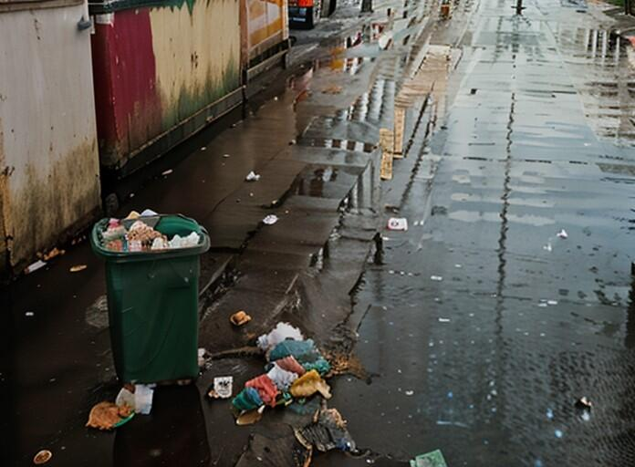

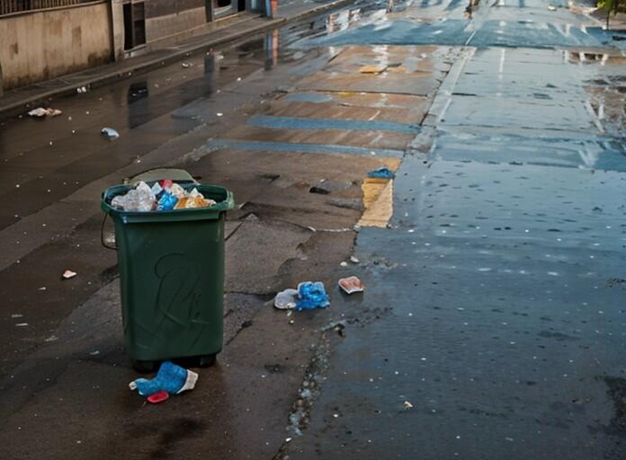

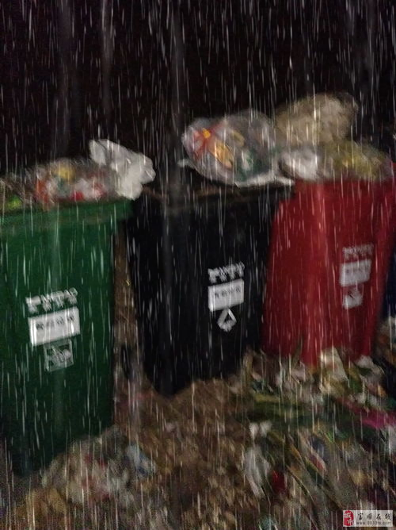
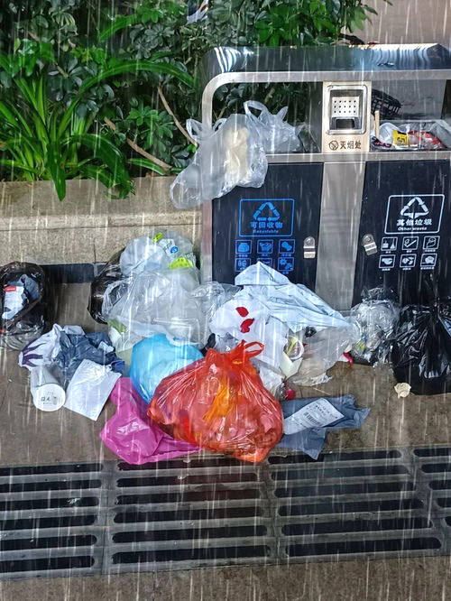

#### 下雪（不同程度的）

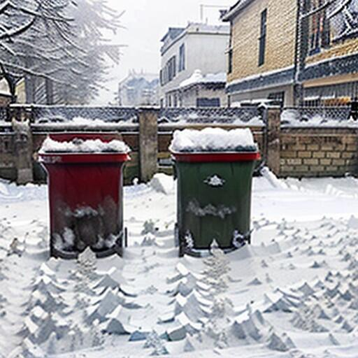

#### 沙尘暴

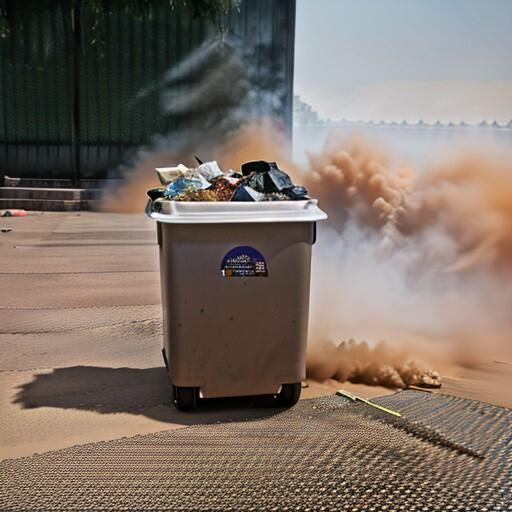

#### 雾/雾霾

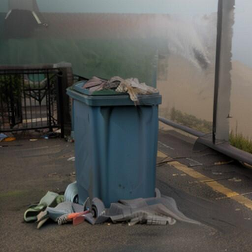

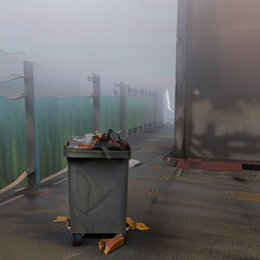

### 光线状态

#### 较暗、傍晚、路灯（或其它灯光）等

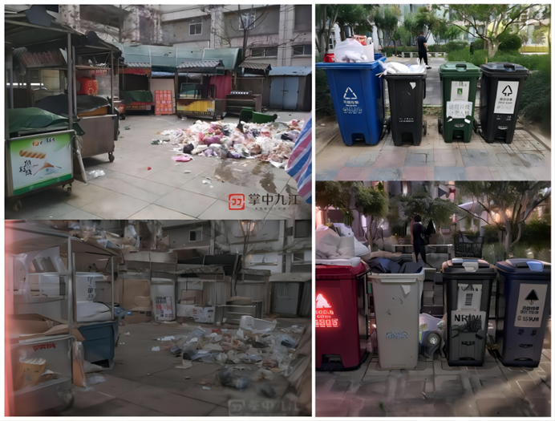

# 实验报告3- 模型推理服务部署

> 本次的模型推理服务部署中，服务器采用的是阿里云的轻量应用服务器，操作系统为CenOS 7.6。前端使用vite+vue3工具链，在本地部署验证通过后生成项目部署到服务器上，使用nginx进行反向代理。后端使用flask框架，部署在服务器上。
> 
> 我们在页面上进行了部分模型的介绍，同样我们也提供了可供选择的模型，用户可以选择自己需要的模型进行推理。我们提供了上传图片的功能，用户可以上传自己的图片进行推理，同时我们也提供了默认的图片供用户选择。用户上传图片后，我们会将图片上传到服务器上，然后进行推理，最后将推理结果返回给用户。
> 
> 此外我们还提供了上传视频的功能，用户可以上传自己的视频进行推理，我们会将视频上传到服务器上，然后进行推理，最后将推理完成的视频返回给用户，供用户下载。我们还提供了默认的视频供用户选择。用户上传视频后，我们会将视频上传到服务器上，然后进行推理，最后将推理完成的视频返回给用户。
> 
> 整体自由度较高，但是考虑到使用的是CPU服务器，所以做视频推理需要耗费较长时间。建议视频时长不要超过5s。那样的话，选择Picodet推理时长大概在1min以内。
> 
> 我们还提供了网页模式选择，风格调整的功能，用户可以根据自己的喜好选择自己喜欢的风格。
>

具体服务部署及技术细节请参照

`传送门`：[实验报告3- 模型推理服务部署](docs/task3/README.md)

## 网页使用介绍

- 网页模式选择，风格调整
- Home部分
- Model部分

### 总览

> 点击 **右侧的齿轮** 按钮可进行页面风格的切换以及页面大小的调整。
> 
> 点击 **左上方的三条横线** 可以展示/关闭左侧的导航栏。
>
> **Home部分** 为链接可通过点击跳转。分别为Bilibili视频介绍链接，Github链接，以及Gitee链接。
>
> **Model部分** 为模型推理部分，分别为Video视频推理部分以及Image图片推理部分。
>

### 网页模式选择，风格调整

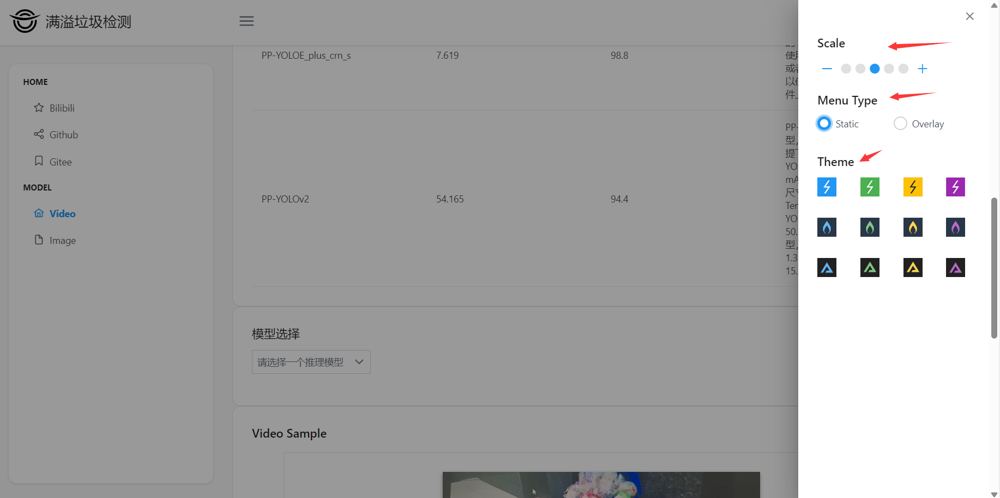

通过 **Scale** 部分的调整可以调整页面显示，总共有5档可供选择。

通过 **Menu Type** 部分的调整可以调整页面风格，总共有Static 和 Overlay 2种风格供选择。

通过 **Theme** 部分的调整可以调整页面主题，总共有12种风格可供选择。

### Home部分

Home部分均为链接可通过点击跳转。分别为Bilibili视频介绍链接，Github链接，以及Gitee链接。

### Model部分

Model部分为模型推理部分，分别为Video视频推理部分以及Image图片推理部分。

#### Video

video部分为视频推理部分，用户可以上传自己的视频进行推理，我们会将视频上传到服务器上，然后进行推理，最后将推理完成的视频返回给用户，供用户下载。

从上往下依次是模型介绍，模型选择，视频样例，视频推理以及上传视频。

**模型介绍**

模型介绍部分列出了部分模型的参数以及简单的介绍，具体细节可以点击左侧Github/Gitee链接进行查看

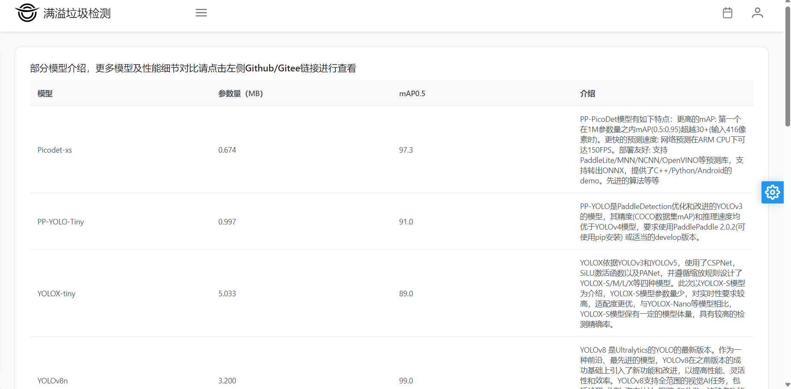

**模型选择**

在模型选择上我们提供了十多种可供选择的推理模型，用户可以选择自己需要的模型进行推理。

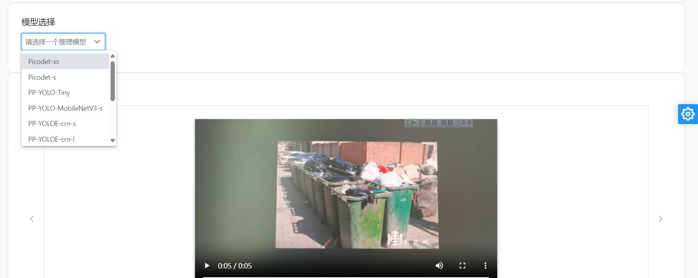

**视频样例**

在视频样例部分我们提供了一个5秒的视频，用户可以点击播放按钮进行播放查看。
点击放大镜按钮即可对样例视频进行推理，推理完成后会返回推理后的视频供用户下载。

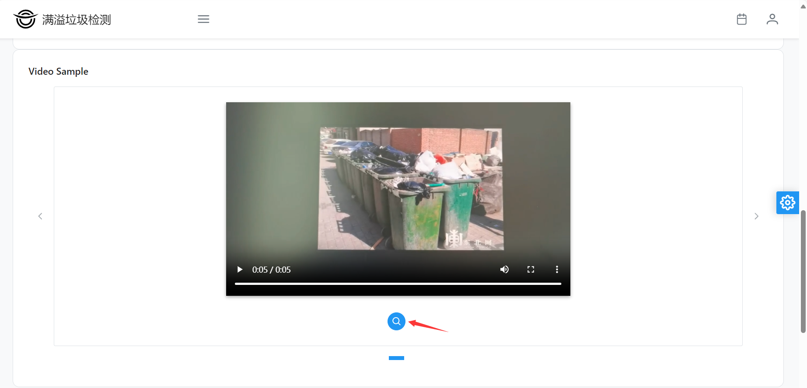

**上传视频及视频推理**

用户也可以先选择自己的视频进行上传推理。具体步骤如下：

1.点击Choose 按钮选择要进行推理的mp4格式的视频文件

2.点击Upload按钮上传视频

3.等待上传完成，点击视频推理

4.等待推理完成，服务器返回推理后的视频

#### Image

Image部分为图片推理部分，用户可以上传自己的图片进行推理，我们会将图片上传到服务器上，然后进行推理，最后将推理结果返回给用户。

从上往下依次是模型选择，图片样例，结果，图片推理以及上传图片。

**模型选择**

在模型选择上我们提供了十多种可供选择的推理模型，用户可以选择自己需要的模型进行推理。

**图片样例**

在图片样例部分我们提供了一张图片。

点击放大镜按钮即可对样例图片进行推理，推理完成后会返回推理后的图片，并在Result部分返回推理产生的json数据。

**上传图片及图片推理**

用户也可以先选择自己的图片进行上传推理。具体步骤如下：

1.点击Choose 按钮选择要进行推理的'jpg','png','jpeg','bmp','.webp'等格式的图片文件

2.点击Upload按钮上传图片

3.等待上传完成，点击开始推理

4.等待推理完成，服务器返回推理后的图片以及json数据

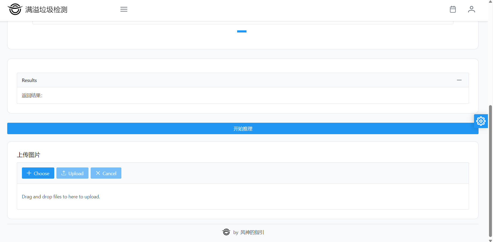

