# 实验报告2- 基于生成模型的数据增强

> 本次的数据增强主要采用Stable Diffusion，基于Stable Diffusion我们利用其文生图，图生图的能力生成了不同程度的下雪，下雨，沙尘暴，雾霾等多种不同天气的数据。于此同时，我们也在夜晚条件下，通过ControlNet获得不同光照情况下生成的数据。为了获得更加逼真的正在下雨效果我们也尝试了一些其他的方法，这里我们采用了基于雨线模型的数据增强以获得更为逼真的正在下雨时的图片数据。总共生成数万张新的数据。
> 
> 我们在给出了相应的生成参数的同时也对与Stable Diffusion相关的生成对抗网络（Generative Adversarial Network ，GAN），变分自编码器（Variational autoencoder，VAE），潜在扩散模型（Latent Diffusion Models，LDMs）的一些基础内容以及基于雨线模型的数据增强做了讲解。
>
> 我们还对数据标注的原理与方法进行了较为详细的讲解，并进行了完整操作流程的演示。

<!-- TOC -->

- [实验报告2- 基于生成模型的数据增强](#实验报告2--基于生成模型的数据增强)
  - [生成式深度学习模型](#生成式深度学习模型)
    - [生成对抗网络（Generative Adversarial Network	，GAN）](#生成对抗网络generative-adversarial-networkgan)
      - [GAN的介绍](#gan的介绍)
      - [GAN的训练过程](#gan的训练过程)
      - [生成器Generator](#生成器generator)
      - [判别器Discriminator](#判别器discriminator)
      - [训练方式](#训练方式)
      - [优化方法](#优化方法)
      - [参考](#参考)
    - [变分自编码器（Variational autoencoder，VAE）](#变分自编码器variational-autoencodervae)
      - [自动编码器（Autoencoder，AE）](#自动编码器autoencoderae)
      - [变分自动编码器（Variational Autoencoder，VAE）](#变分自动编码器variational-autoencodervae)
          - [VAE的数学建模过程：](#vae的数学建模过程)
          - [vae的训练过程：](#vae的训练过程)
    - [潜在扩散模型（Latent Diffusion Models，LDMs）](#潜在扩散模型latent-diffusion-modelsldms)
      - [方法](#方法)
      - [图片感知压缩（Perceptual Image Compression）](#图片感知压缩perceptual-image-compression)
      - [潜在扩散模型（Latent Diffusion Models）](#潜在扩散模型latent-diffusion-models)
      - [条件机制（Conditioning Mechanisms）](#条件机制conditioning-mechanisms)
  - [基于雨线模型的数据增强](#基于雨线模型的数据增强)
    - [模型简介：](#模型简介)
    - [模型详解：](#模型详解)
      - [雨滴模型](#雨滴模型)
        - [雨滴形状](#雨滴形状)
        - [雨滴终速](#雨滴终速)
        - [雨滴生成](#雨滴生成)
      - [雨线模型](#雨线模型)
        - [绘制方程](#绘制方程)
        - [自适应采样](#自适应采样)
        - [绘制算法](#绘制算法)
    - [结果展示](#结果展示)
  - [数据增强](#数据增强)
    - [天气状态](#天气状态)
      - [下雨（不同程度的）](#下雨不同程度的)
      - [下雪（不同程度的）](#下雪不同程度的)
      - [沙尘暴](#沙尘暴)
      - [雾/雾霾](#雾雾霾)
    - [光线状态](#光线状态)
      - [较暗、傍晚、路灯（或其它灯光）等](#较暗傍晚路灯或其它灯光等)
    - [一些在线生成网站](#一些在线生成网站)
  - [数据标注——原理与方法](#数据标注原理与方法)
    - [什么是数据标注？](#什么是数据标注)
    - [数据标记的工作原理](#数据标记的工作原理)
    - [有标签数据与无标签数据](#有标签数据与无标签数据)
    - [标注细节（本例+百度EasyData）](#标注细节本例百度easydata)
    - [数据标注优化方法](#数据标注优化方法)
    - [使用场景](#使用场景)
    - [参考链接](#参考链接)

<!-- /TOC -->
## 生成式深度学习模型


### 生成对抗网络（Generative Adversarial Network	，GAN）

#### GAN的介绍

GAN的全称是Generative adversarial network，中文翻译过来就是生成对抗网络。生成对抗网络其实是两个网络的组合：生成网络（Generator）负责生成模拟数据；判别网络(Discriminator）负责判断输入的数据是真实的还是生成的。生成网络要不断优化自己生成的数据让判别网络判断不出来，判别网络也要优化自己让自己判断得更准确。二者关系形成对抗，因此叫对抗网络。

#### GAN的训练过程

1.随机生成一组潜在向量z，并使用生成器生成一组假数据。
2.将一组真实数据和一组假数据作为输入，训练判别器。
3.使用生成器生成一组新的假数据，并训练判别器。
4.重复步骤2和3，直到生成器生成的假数据与真实数据的分布相似。

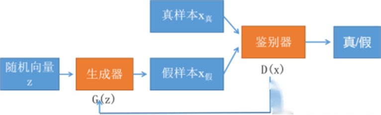

#### 生成器Generator

生成器G是一个生成图片的网络，可以采用多层感知机、卷积网络、自编码器等。

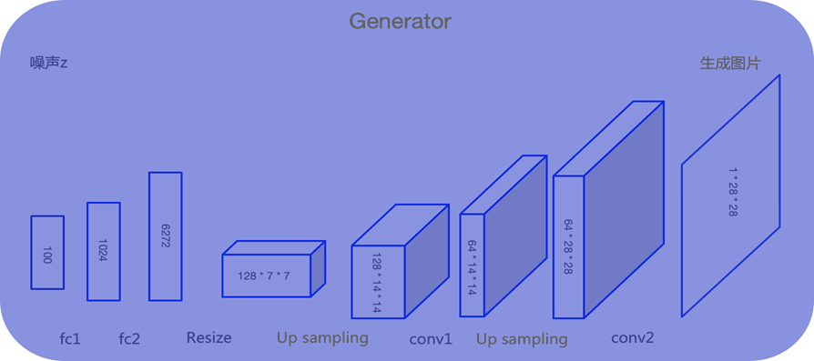

#### 判别器Discriminator

判别器D的输入为真实图像和生成器生成的图像，其目的是将生成的图像从真实图像中尽可能的分辨出来。

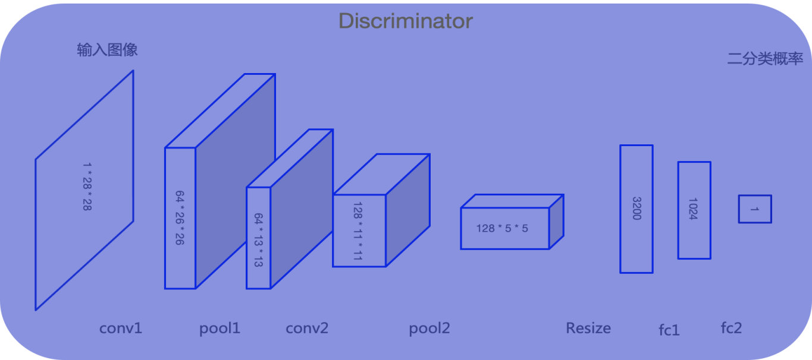

#### 训练方式

训练时先训练鉴别器D 将真实图片打上真标签1和生成器G生成的假图片打上假标签0，一同组成batch送入判别器D，对判别器进行训练。计算loss时使判别器对真实图像输入的判别趋近于真，对生成的假图片的判别趋近于假。此过程中只更新判别器的参数，不更新生成器的参数。

然后再训练生成器G 将高斯分布的噪声z送入生成器G，将生成的假图片打上真标签1送入判别器D。计算loss时使判别器对生成的假图片的判别趋近于真。此过程中只更新生成器的参数，不更新判别器的参数。

#### 优化方法

训练GAN的时候，可以采取以下训练技巧：
1）生成器最后一层的激活函数用tanh()，输出归一化至[-1, 1]；
2）真实图像也归一化到[-1,1]之间；
3）学习率不要设置太大，初始1e-4可以参考，另外可以随着训练进行不断缩小学习率；
4）优化器尽量选择Adam，因为SGD解决的是一个寻找最小值的问题，GAN是一个博弈问题，使用SGD容易震荡；
5）避免使用ReLU和MaxPool，减少稀疏梯度的可能性，可以使用Leak Re LU激活函数，下采样可以用Average Pooling或者Convolution + stride替代。上采样可以用PixelShuffle, ConvTranspose2d + stride；
6）加噪声：在真实图像和生成图像中添加噪声，增加鉴别器训练难度，有利于提升稳定性；
7）如果有标签数据，尽量使用标签信息来训练；
8）标签平滑：如果真实图像的标签设置为1，我们将它更改为一个较低的值，比如0.9，避免鉴别器对其分类过于自信 。

#### 参考

https://blog.csdn.net/sinat_39620217/article/details/130982812?utm_medium=distribute.pc_relevant.none-task-blog-2~default~baidujs_baidulandingword~default-0-130982812-blog-108818102.235^v40^pc_relevant_rights_sort&spm=1001.2101.3001.4242.1&utm_relevant_index=3

https://blog.csdn.net/qq_41771998/article/details/129954096

https://blog.csdn.net/m0_61878383/article/details/122462196?ops_request_misc=%257B%2522request%255Fid%2522%253A%2522170521924516800197027257%2522%252C%2522scm%2522%253A%252220140713.130102334..%2522%257D&request_id=170521924516800197027257&biz_id=0&utm_medium=distribute.pc_search_result.none-task-blog-2~all~top_positive~default-1-122462196-null-null.142^v99^pc_search_result_base4&utm_term=GAN&spm=1018.2226.3001.4187


### 变分自编码器（Variational autoencoder，VAE）

#### 自动编码器（Autoencoder，AE）

再讲VAE之前，有必要先简单介绍一下**自动编码器AE**，自动编码器是一种**无监督学习**方法，它的原理很简单：先将高维的原始数据映射到一个低维特征空间，然后从低维特征学习重建原始的数据。一个AE模型包含两部分网络：

- **Encoder：**将原始的高维数据映射到低维特征空间，这个特征维度一般比原始数据维度要小，这样就起到压缩或者降维的目的，这个低维特征也往往成为中间隐含特征（latent representation）；

- **Decoder**：基于压缩后的低维特征来重建原始数据；

  最简单的自编码器如下，一个三层的线性网络（无激活函数），先对输入 x 进行降维得到 z ，再重构得到 x^ ，希望 x^→x 。一个非常完美的对称结构。
  
  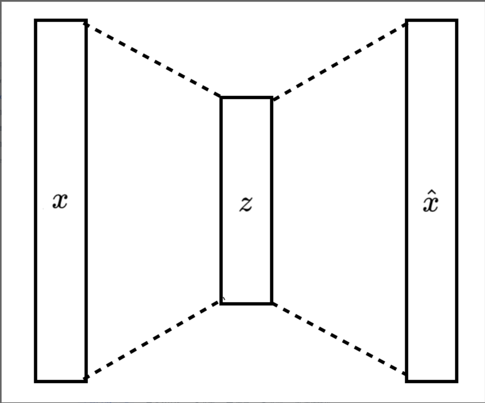

AE有很多变种，比如经典的**去噪自编码器（Denoising Autoencoder，DAE）**，与原始AE不同的是，在训练过程先对输入进行一定的扰动，比如增加噪音或者随机mask掉一部分特征。相比AE，DAE的重建难度增加，这也使得encoder学习到的隐含特征更具有代表性。

#### 变分自动编码器（Variational Autoencoder，VAE）

###### VAE的数学建模过程：

VAE虽然名字里也带有自动编码器，但这主要是因为VAE和AE有着类似的结构，即encoder和decoder这样的架构设计。实际上，VAE和AE在建模方面存在很大的区别，从本质上讲，VAE是一种基于变分推断（Variational Inference, Variational Bayesian methods）的概率模型（Probabilistic Model），它属于生成模型（当然也是无监督模型）,生成模型的目标就是最大似然估计 (MLE)。

在变分推断中，除了已知的数据（观测数据，训练数据）:

<!-- $$
X=\left\{ x^{(i)} \right\}_{i=1}^{N}
$$ --> 

<div align="center">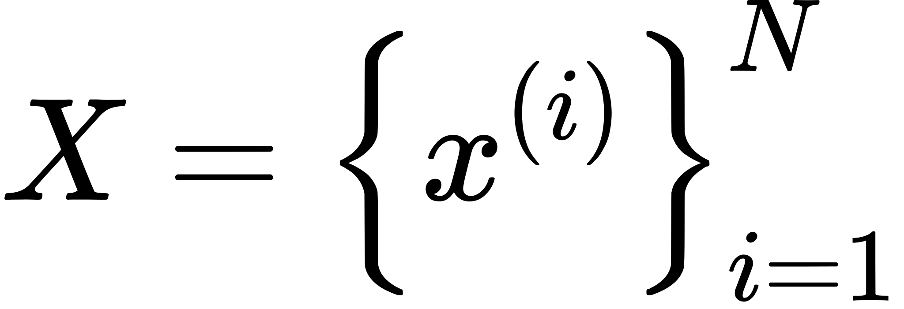</div>


外还存在一个隐含变量，这里已知的数据集记为由N个连续变量或者离散变量x组成，而未观测的随机变量记为z，那么数据的产生包含两个过程：

1. 从一个先验分布Pθ(z)中采样一个z(i)；

2. 根据条件分布Pθ(x|z)，用z(i)生成x(i)。

   （θ指分布函数参数）我们就期望找到一个θ*使得生成真实数据的概率最大化:

<!-- $$
\theta^{*}=\arg \max _{\theta} \prod_{i=1}^{n} p_{\theta}\left(\mathbf{x}^{(i)}\right)
$$ --> 

<div align="center">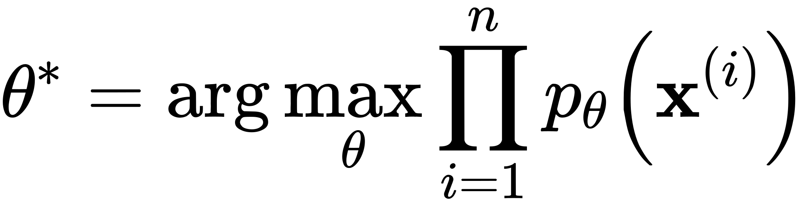</div>

这里Pθ*(X(i))可以通过对z积分得到:
$$
\begin{array}{l}
p_{\theta}(x)=\int p_{\theta}(x, z) d z \\
=\int p_{\theta}(z) p_{\theta}(x \mid z) d z \\
\quad=E_{p_{\theta}(z)} p_{\theta}(x \mid z)
\end{array}
\\
$$
而实际上要根据上述积分是不现实的，一方面先验分布Pθ(z)是未知的，而且如果分布比较复杂，对z穷举计算也是极其耗时的。为了解决这个难题，变分推断引入后验分布Pθ(z|x)来联合建模，根据[贝叶斯公式](https://link.zhihu.com/?target=https%3A//en.wikipedia.org/wiki/Bayes%27_theorem)，后验等于：
$$
p_{\theta}(\mathbf{z} \mid \mathbf{x})=\frac{p_{\theta}(\mathbf{x} \mid \mathbf{z}) p_{\theta}(\mathbf{z})}{p_{\theta}(\mathbf{x})}
$$
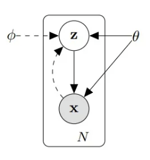

这样的联合建模如上图所示，实线代表的是我们想要得到的生成模型Pθ(x|z)Pθ(z)，其中先验分布Pθ(z)往往是事先定义好的（比如标准正态分布），而Pθ(x|z)可以用一个网络来学习，类比AE的话，如果把z看成隐含特征，那么这个网络就可以看成一个probabilistic decoder。虚线代表的是对后验分布Pθ(z|x)的变分估计，记为QΦ(z|x)，它也可以用一个网络来学习，这个网络可以看成一个probabilistic encoder。可以看到，VAE和AE在架构设计上是类似的，只不过这里probabilistic encoder和probabilistic decoder学习的是两个分布。对于VAE来说，最终目标是得到生成模型即decoder，而encoder只是为了辅助建模，但对于AE来说，常常是为了得到encoder来进行特征提取或者压缩。

这样就完成了对VAE的数学建模。

###### vae的训练过程：

VAE在训练过程中，会在Encoder的编码上加上一个扰动（或限制），它的训练过程如下：

1. 通过深度学习网络，我们可以将输入 X 投影到某一隐空间 Latent Space的编码方式（也就是一个编码模型，称之为Encoder过程）。这样，我们可以获得所有输入 X 的隐状态编码（Representation in Latent Space）；
2. 根据上述的隐状态编码，我们构建两个**需要学习**的层（μ，σ）。设置随机数epsilon，根据参数（μ，σ），可以随机获得一个新的隐藏数据z。重复多次，获得一个数据集（Z', X'）。*注意：这其实是一种构建扰动的方法，还可以有其他种*；
3. 训练一个神经网络，输入输出为（Z', X'）。即将扰动数据z重新映射为原输入数据x，称之为Decoder过程。

### 潜在扩散模型（Latent Diffusion Models，LDMs）

[High-Resolution Image Synthesis with Latent Diffusion Models](https://arxiv.org/abs/2112.10752)

- Latent Diffusion Models规避了Diffusion Models的高昂的计算成本，使文图生成能够在消费级GPU上快速生成图片。
- 相比于其它空间压缩方法，论文提出的方法可以生成更细致的图像，并且在高分辨率图片生成任务（如风景图生成，百万像素图像）上表现得也很好。
- 论文还提出了cross-attention的方法来实现多模态训练，使得条件图片生成任务也可以实现。论文中提到的条件图片生成任务包括类别条件图片生成（class-condition）, 文图生成（text-to-image）, 布局条件图片生成（layout-to-image）。这也为日后Stable Diffusion的开发奠定了基础。

#### 方法

> 我们主要来看一下论文High-Resolution Image Synthesis with Latent Diffusion Models的方法部分。

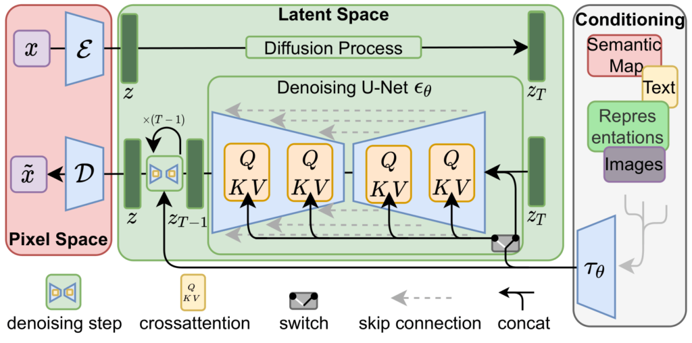


Latent Diffusion Models整体框架如上图所示，首先需要训练好一个自编码模型（AutoEncoder，包括一个**编码器**$\varepsilon$和一个**解码器** $D$）,这个编码模型将压缩学习阶段与生成学习阶段明确分开以降低计算复杂度。这样一来，我们就可以利用编码模型对图片进行压缩，然后在潜在表示空间上做**扩散操作（Diffusion Process）**，最后我们再用解码器恢复到原始像素空间，论文将这种将高维特征压缩到低维，然后在低维空间上进行操作的方法称之为**感知压缩（Perceptual Compression）**。

在潜在表示空间上做**扩散操作（Diffusion Process）**其主要过程和标准的扩散模型没有太大的区别，所用到的扩散模型的具体实现为 time-conditional UNet。但是有一个重要的地方是论文为diffusion操作引入了**条件机制（Conditioning Mechanisms）**，通过cross-attention的方式来实现多模态训练，使得条件图片生成任务也可以实现。

#### 图片感知压缩（Perceptual Image Compression）

感知压缩通过对所学的空间 $z$ 进行任意的一维排序来对其分布进行自回归建模，从而忽略掉 $z$ 的许多固有结构。引入感知压缩就是说通过VAE这类自编码模型对原图片进行处理，忽略掉图片中的高频信息，只保留重要、基础的一些特征。这种方法，能够大幅降低训练和采样阶段的计算复杂度，让文图生成等任务能够在消费级GPU上快速生成图片。

感知压缩主要利用一个预训练的自编码模型，该模型能够学习到一个在感知上等同于图像空间的潜在表示空间。这种方法的一个优势是只需要训练一个通用的自编码模型，就可以用于不同的扩散模型的训练，在不同的任务上使用。

由此，基于感知压缩的扩散模型的训练本质上是一个**两阶段训练的过程**，第一阶段需要训练一个自编码器，第二阶段才需要训练扩散模型本身。在第一阶段训练自编码器时，为了避免潜在表示空间出现高度的异化，作者尝试了两种正则化方法，一种是KL-reg，另一种是VQ-reg，因此在官方发布的一阶段预训练模型中，会看到KL和VQ两种实现。在Stable Diffusion中主要采用AutoencoderKL这种实现。

具体来说，给定图像$x \in \mathbb{R}^{H \times W \times 3}$ ，我们可以先利用一个编码器 $\varepsilon$ 来将图像编码到潜在表示空间$z=\varepsilon(x)$ ，其中 $z \in \mathbb{R}^{h \times w \times c}$，然后再用解码器从潜在表示空间重建图片$\tilde{x} = D(z) = D(\varepsilon(x))$ 。在感知压缩压缩的过程中，下采样系数的大小为 $f = \frac{H}{h}=\frac{W}{w}$， $f=2^{m},m \in N$ 。

#### 潜在扩散模型（Latent Diffusion Models）

首先看一下普通的**扩散模型（Diffusion Models，DMs）**，它是一种概率模型。可以解释为一个时序去噪自编码器（equally weighted sequence of denoising autoencoders） $\epsilon_{\theta}(x_{t},t);t=1, \cdots ,T$，其目标是根据输入$x_{t}$去预测一个对应去噪后的变体，或者说预测噪音，其中$x_{t}$是输入 $x$ 的噪音版本。相应的目标函数可以写成如下形式：

<!-- $$
L_{DM}=\mathbb{E}_{x,t \sim \mathcal{N}(0,1),t}[\parallel \epsilon-\epsilon_{\theta}(z_{t},t) \parallel_{2}^{2}]
$$ --> 

<!-- <div align="center">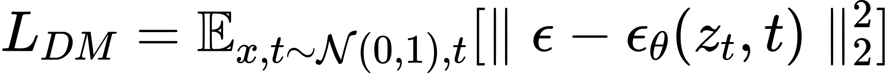</div> -->
<div align="center"></div>

其中 $t$从 $\{1,\cdots,T\}$ 中均匀采样获得。

在**潜在扩散模型**中，引入了预训练的感知压缩模型，它包括一个编码器 $\varepsilon$ 和一个解码器 $D$。这样就可以利用在训练时就可以利用编码器得到 $z_{t}$，从而让模型在潜在表示空间中学习，相应的目标函数可以写成如下形式：


<!-- $$
L_{LDM} \coloneqq \mathbb{E}_{x,t \sim \mathcal{N}(0,1),t}[\parallel \epsilon-\epsilon_{\theta}(z_{t},t) \parallel_{2}^{2}]
$$ -->

<!-- $$
L_{LDM} := \mathbb{E}_{x,t \sim \mathcal{N}(0,1),t}[\parallel \epsilon-\epsilon_{\theta}(z_{t},t) \parallel_{2}^{2}]
$$ --> 

<div align="center"></div>


#### 条件机制（Conditioning Mechanisms）

除了无条件图片生成外，我们也可以进行条件图片生成，这主要是通过拓展得到一个条件时序去噪自编码器（conditional denoising autoencoder）$\epsilon_{\theta}(z_{t},t,y)$ 来实现的，这样一来我们就可通过 $y$ 来控制图片合成的过程。具体来说，论文通过在UNet主干网络上增加cross-attention机制来实现$\epsilon_{\theta}(z_{t},t,y)$。为了能够从多个不同的模态预处理 $y$ ，论文引入了一个领域专用编码器（domain specific encoder）$\tau_{\theta}$ ，它用来将 $y$ 映射为一个中间表示 $\tau_{\theta}(y) \in \mathbb{R}^{M \times d_{\tau}}$ ，这样我们就可以很方便的引入各种形态的条件（文本、类别、layout等等）。最终模型就可以通过一个cross-attention层映射将控制信息融入到UNet的中间层，cross-attention层的实现如下：

$$
Attention(Q,K,V) = softmax(\frac{QK^T}{\sqrt{d}} \cdot V), with \\
Q  = W_{Q}^{(i)} \cdot \varphi_{i}(z_{t}),K=W_{K}^{(i)} \cdot \tau_{\theta}(y)
$$


其中 $\varphi_{i}(z_{t}) \in \mathbb{R}^{N \times d_{\epsilon}^{i}}$ 是UNet的一个中间表征。相应的目标函数可以写成如下形式：


<!-- $$
L_{LDM} := \mathbb{E}_{\varepsilon(x),t \sim \mathcal{N}(0,1),t}[\parallel \epsilon-\epsilon_{\theta}(z_{t},t) \parallel_{2}^{2}]
$$ --> 

<div align="center"></div>


参考：

https://arxiv.org/abs/2112.10752

https://ommer-lab.com/research/latent-diffusion-models/

https://zhuanlan.zhihu.com/p/582693939


## 基于雨线模型的数据增强

### 模型简介：

**模型概要**

利用光照和视点效果对雨线进行逼真的渲染是一个具有挑战性的问题。雨滴在下落时会迅速变形，这种现象被称为振荡。由于这些振荡、光线的反射和光线的折射，下落的雨滴在相机捕捉或人类观察到的单一运动模糊的雨线内产生了复杂的亮度模式。

在这项研究中，提出了一个新的雨线外观模型，该模型捕捉了照明方向、观看方向和水滴振荡形状之间的复杂相互作用。通过已经在各种场景中渲染了雨水，结果表明，基于物理的雨线模型大大增强了渲染雨水的视觉逼真度。

**模型应用**

该模型可以应用于电影、动画和游戏等领域，以增强雨水视觉效果。例如，该模型可以用于生成逼真的雨天场景，增强电影的真实感。该模型还可以用于生成逼真的雨天特效，增强游戏的沉浸感。

**模型优点**

该模型具有以下优点：

- 可以生成逼真的雨线，具有复杂的亮度模式。
- 可以模拟雨线在不同照明条件下的外观。
- 可以模拟雨线在不同视点下的外观。

**模型局限性**

该模型也存在以下局限性：

- 该模型的计算复杂度较高。
- 该模型需要大量的训练数据。

### 模型详解：

参考资料:         **Photorealistic Rendering of Rain Streaksecognition**

​          		   	**https://www1.cs.columbia.edu/CAVE/publications/pdfs/Garg_TOG06.pdf**

该模型主要包括以下几个部分：

- **雨滴模型**

- **雨线模型**

#### 雨滴模型

##### 雨滴形状

雨滴在空中下落过程中会发生震荡，主要有两种震荡模式: 一种是轴对称模式，一种是非轴对称模式。

用公式来表示雨滴模型，即

$$
\begin{gathered}
r(t,\theta,\varphi)= r_{0}[1+A_{2,0}\sin\left(\omega_{2}t\right)P_{2,0}\left(\theta\right)+ \left.A_{3,1}\sin\left(\omega_{3}t\right)\cos\left(\varphi\right)P_{3,1}\left(\theta\right)\right] 
\end{gathered}
$$

式中，r 为雨滴表面点离雨滴中心的距离，$\theta$ 和 $\varphi$ 分别为该点关于$z$ 轴和$x$ 轴的倾斜角和方位角，$r_{0}$ 为雨滴半径，$A_{2,0}$为轴对称模式幅值，$A_{3,1}$为非轴对称模式幅值，$P_{2,0}\left(\theta\right)$ 和$P_{3,1}\left(\theta\right)$为 Legendre 多项式。 

雨滴模型和绘制所用坐标系如下图所示：

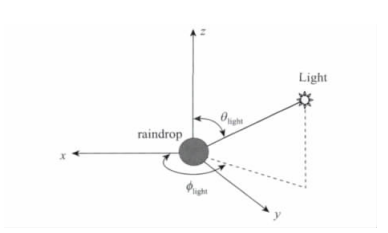

##### 雨滴终速

在天然降雨中，雨滴降落至某一高度时所受的空气阻力与其重力相等，此后雨滴会以某一速度匀速降落到地面，这个速度叫做雨滴的终点速度，简称雨滴终速，它取决于雨滴半径。

如下图所示，根据数据，用三次多项式拟合雨滴半径与天然降雨中雨滴终速 $v$ m/s 的关系。拟合公式为

$$
\begin{array}{rcl}v=0.34785r_0^3-3.17414r_0^2+9.49157r_0-0.10374\end{array}
$$

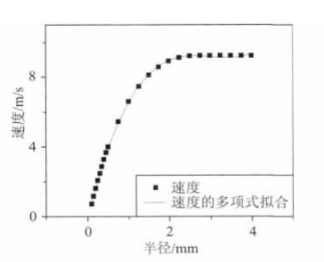

雨滴终速除了可以天然降雨的雨滴速度外，也可以根据实际的物理方程解算或设定想要的速度值。

##### 雨滴生成

使用粒子系统来产生雨滴的动画。粒子系统中雨滴的参数包括半径$r_{0}$，空间位置$(x_0,y_0,z_0)\:$， 旋转角$\phi_\mathrm{rot}$，速度$v$，时间$t$。

1. 给定雨滴半径 $r_{0}$,可由雨滴大小计算雨滴速度 $v$,或者设置想要的雨滴速度；
2.  根据雨滴密度和场景空间范围生成空间位置$(x_0,y_0,z_0)$,旋转角$\phi_\mathrm{rot}$与时间$t$ 随机分布的雨滴；
3. 根据雨滴速度计算下一个时间步雨滴新的位置，如果超出场景空间范围则雨滴消失;
4. 判断时间步是否超出设定值，是则结束，否则转步骤 2 。

#### 雨线模型

##### 绘制方程

考虑到曝光时间$T$,在像素位置$(x,y)$ 处的像素值可表示为

$$
I_{xy}\:=\:\int_{\Omega}\:\int_{T}r\:(\:\omega\:,t)\:L\:(\omega\:,t)\:\mathrm{d}t\mathrm{d}\omega
$$
式中，$\omega$ 为像素对应的立体角，$\iota$ 为时间，$r(\omega,t)$ 为重构滤波器，$L(\omega,t)$ 为入射辐射度。
根据 Cook 等人的分布式光线跟踪方法，采用 Monte Carlo 方法对上式进行近似积分计算
$$
I_{xy}\:\approx\:\frac{1}{N}\sum_{j=1}^{N}\:r\:(\omega_{j},t_{j})\:L\:(\omega_{j},t_{j})
$$

式中，$N$ 为每个像素的采样数。

##### 自适应采样

对于没有雨线存在的像素点不需要太多的采样数，所以可设置小的初始采样数，判断初始光线是否和雨滴的运动包围盒相交，如果相交则增大该像素点的采样数，保证了生成雨线所需的采样数。

用这种自适应采样方法可大大减少没有雨线存在的像素点的采样数，进一步加速了绘制。

##### 绘制算法

1)分别对归纳的 1024 种雨滴形状生成三角形网格并建立 kd-tree 加速结构。

2) 根据雨滴运动包围盒对整个场景建立 BVH(层次包围盒) 或 kd-tree 加速结构。

3) 设置初始采样数，使用低差异采样方法对像素位置$(x,y)$ 和时间 $t$ 进行采样，生成采样光线。

4) 根据 2.1.2  节中的自适应采样方法判断是否需要生成更多的采样光线。对存在雨线的像素点使用大的采样数。

5) 用(2.2.1) 中的式子计算图像的每个像素值。

### 结果展示

<center class="half">
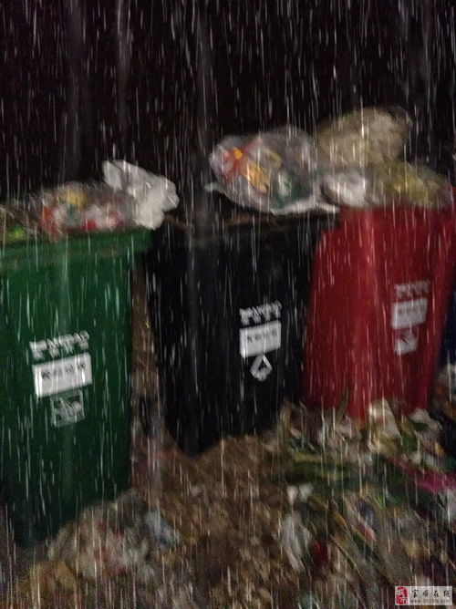
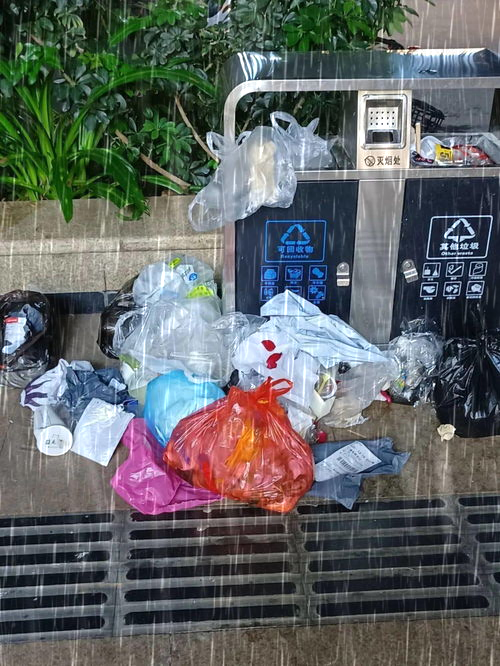
</center>

## 数据增强

### 天气状态

#### 下雨（不同程度的）

<center class="half">
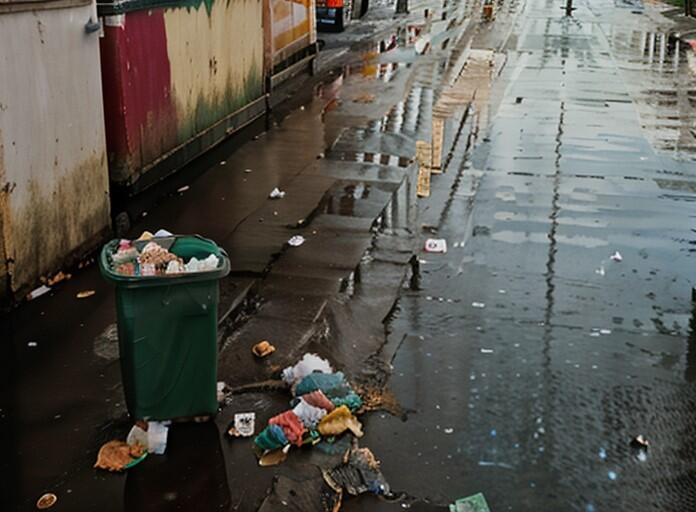


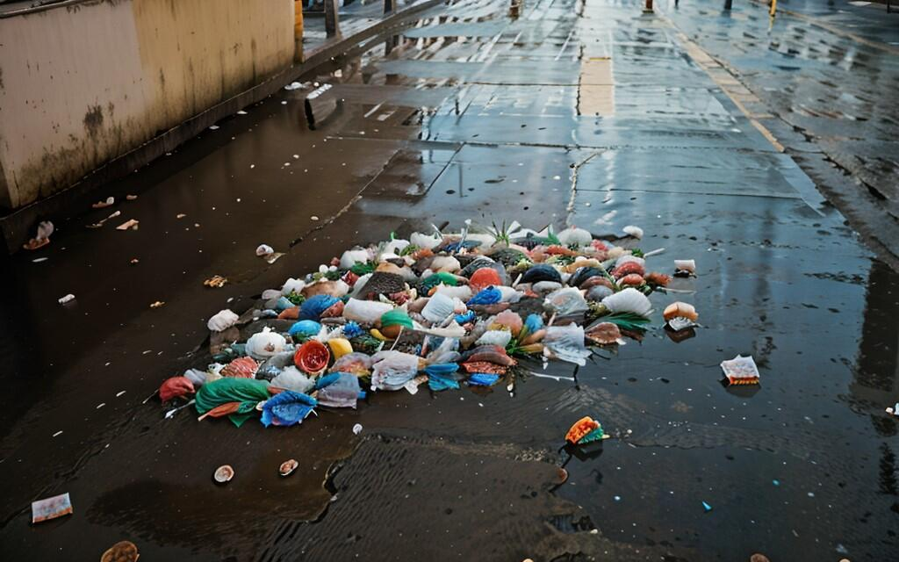
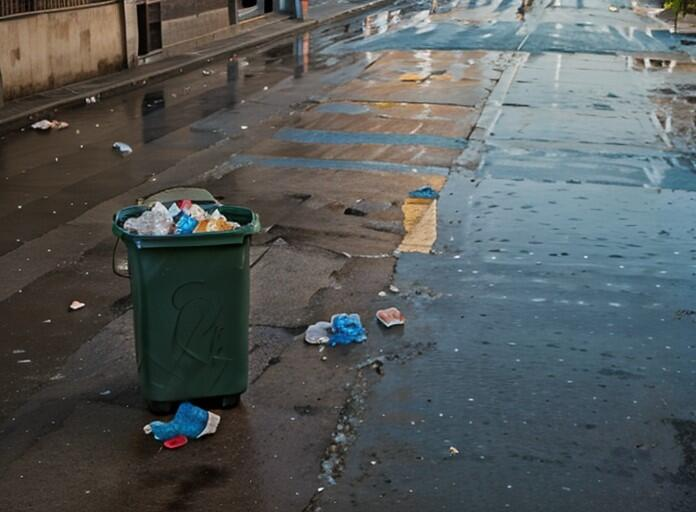
</center>

<div>
<center class="one">


</center>
</div>


#### 下雪（不同程度的）

<center class="half">
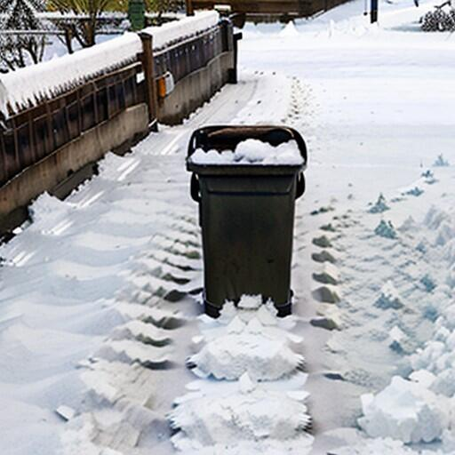
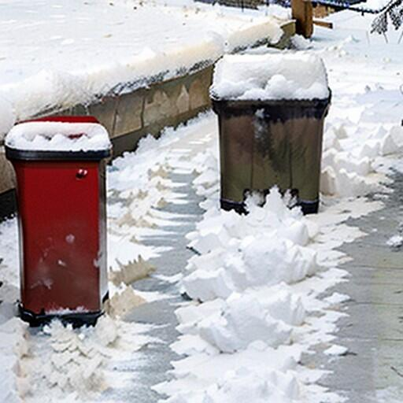
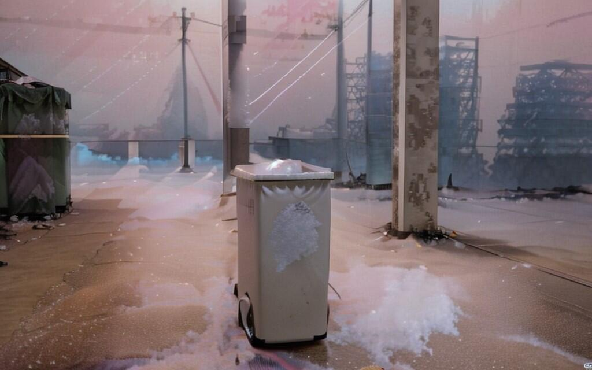

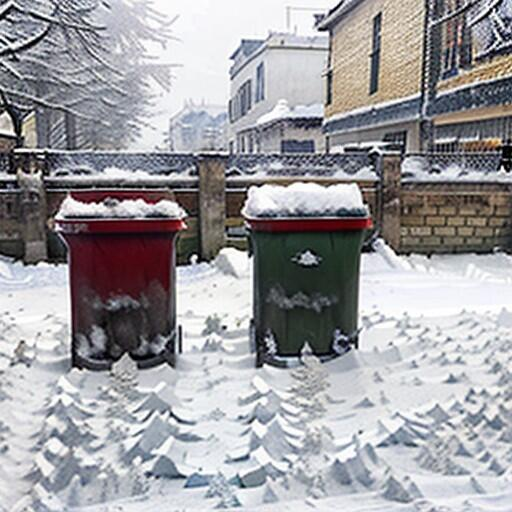
</center>


[Heavy snowfall - v1.0 | Stable Diffusion LoRA | Civitai](https://civitai.com/models/219932/heavy-snowfall)

```yaml
snowy,winter,(snowfall in background:1.2),(heavyfall:1.15),snow,very snowy,photorealistic,<lora:snowfall:0.8>,
Negative prompt: Unrealistic,
Steps: 20, Sampler: DPM++ 2M Karras, CFG scale: 7, Seed: 712934690, Size: 500x375, Model hash: fe7578cb5e, Model: realisticVisionV60B1_v60B1VAE, VAE hash: 735e4c3a44, VAE: vae-ft-mse-840000-ema-pruned.safetensors, Denoising strength: 0.34, Clip skip: 2, Lora hashes: "snowfall: f8324b7af7d9", Version: v1.6.0-2-g4afaaf8a
```

重绘幅度:0.34,0.35

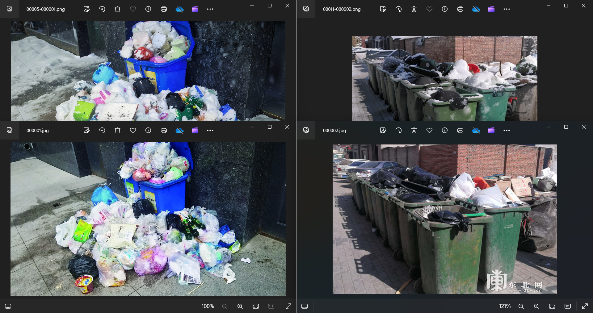


#### 沙尘暴

<center class="half">
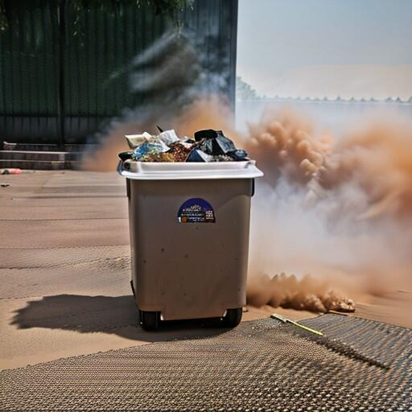
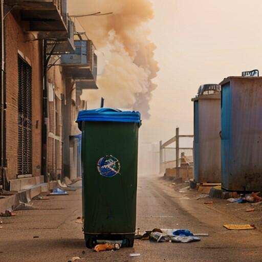
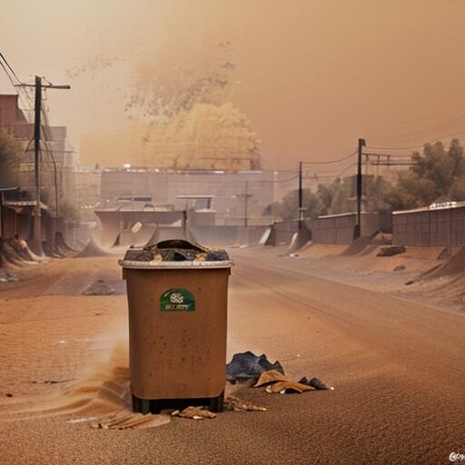
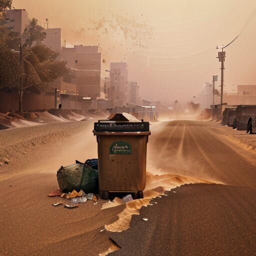

</center>

#### 雾/雾霾

<center class="half">
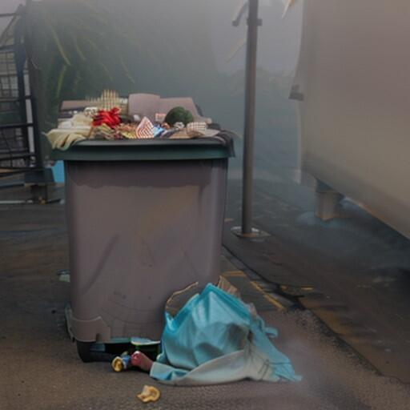
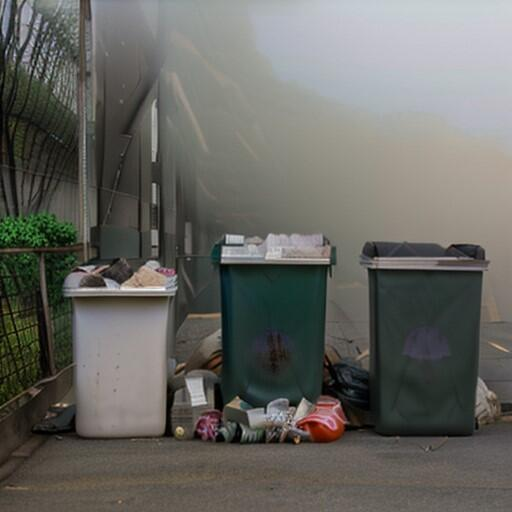
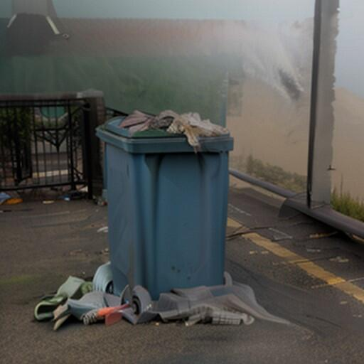
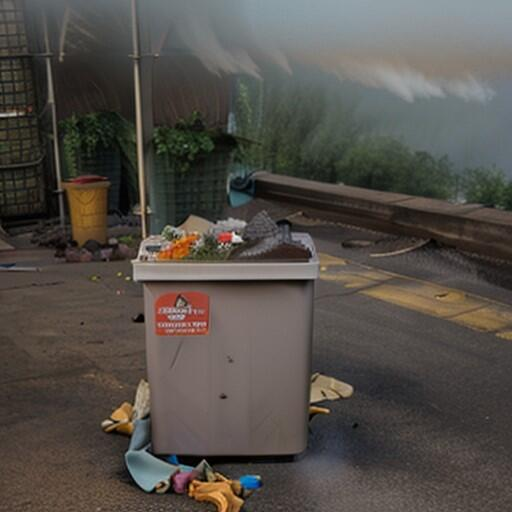
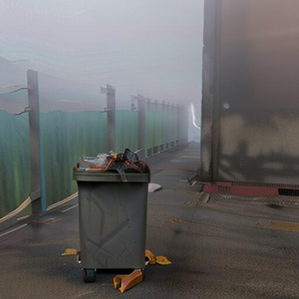
</center>


### 光线状态

#### 较暗、傍晚、路灯（或其它灯光）等

https://civitai.com/models/38784?modelVersionId=67566
https://civitai.com/models/4201/realistic-vision-v60-b1
https://civitai.com/models/128607/nightvision-xl-photorealistic-or-portrait-or-photography-or-hyperreal-or-architecture-or-interior-design-no-refiner-needed

```yaml
Realism,(dark:1.2),(night:1.5),trash can,trash bag,trash,photo,real,
Negative prompt:comic,pixel art,((dyeing)),((oil painting)),((impasto)),oil_painting,highres,
Steps: 20,Sampler: DPM++ 3M Karras，CFG scale: 7, Seed: -1,Si
```

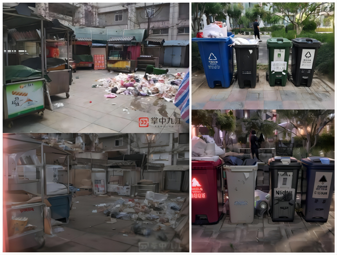

ze: 500x375，Model: realisticVisionV60B1_v60B1VAE, VAE: vae-ft-mse-840000-ema-pruned.safetensors,
Clip skip: 2
重绘幅度:0.6


### 一些在线生成网站

一些我们使用后，感觉比较好用的在线图片生成网站。
1.  一天300张免费的，类似stable difusion: https://www.liblib.art/
2. 阿里巴巴的一天限量几百张，可设置选项有限https://tongyi.aliyun.com/wanxiang/?utm_source=ai-bot.cn
3. 免费的不限量，设置选项相对有限https://miaohua.sensetime.com/zh-CN


## 数据标注——原理与方法

### 什么是数据标注？

数据标注（或称数据注释）是开发[机器学习](https://www.ibm.com/cn-zh/topics/machine-learning) (ML) 模型时预处理阶段的一部分。 它负责识别原始数据（如图像、文本文件、视频），然后向原始数据添加一个或多个标签，以指定模型的上下文，帮助机器学习模型做出准确的预测。例如，标签可指示相片是否包含鸟或汽车、录音中有哪些词发音，或者 X 影像是否包含肿瘤。各种使用案例都需要用到数据标记，包括计算机视觉、自然语言处理和语音识别。


### 数据标记的工作原理

如今最实用的机器学习模型利用的是监督学习，它应用算法以将一个输入映射到一个输出。为了使监督学习发挥作用，我们需要一组带标签的数据，使模型能够从中学习以做出正确的决定。数据标记的起点通常是要求人类就指定的无标签数据做出判断。例如，标记者可能需要为数据集中“相片是否包含鸟”的答案为“是”的所有图片添加标签。添加标签可能像简单的是/否一样粗疏，也可能像识别图片中与鸟相关的像素一样精细。机器学习模型在模型训练的流程中，使用人类提供的标签学习背后的模式。 这样训练过的模型，可用于对新数据进行预测。

在机器学习中，用作客观标准来训练和评估指定模型的正确标记的数据集通常称为“标准答案”。 训练过的模型的准确度将取决于标准答案的准确度，因此付出一些时间和资源来确保高准确度的数据标记至关重要。

### 有标签数据与无标签数据  

- 有标签数据用于[监督式学习](https://www.ibm.com/cn-zh/topics/supervised-learning)， 而无标签数据用于[无监督学习](https://www.ibm.com/cn-zh/topics/unsupervised-learning)。 
- 有标签数据更难以收集和存储（既耗时又费力），而无标签数据更易于收集和存储。
- 有标签数据可用于确定切实可行的洞察（例如预测任务），而无标签数据的用途则比较有限。 无监督学习方法可以帮助发现新的数据聚类，从而能够在添加标签时新建类别。

计算机还可以结合使用这两种数据进行半监督学习，这样可以减少对手动添加数据标签的需求，同时提供添加了注释的大型数据集。

### 标注细节（本例+百度EasyData）

采用矩形框标记，标注的类别主要分三类：**分别是未满溢的垃圾桶、满溢的垃圾桶和垃圾**

- 每个矩形框中指包含一个物体，不可以将两个物体合并标注
- 矩形框的大小不应过大或过小，应刚好框住物体
- 矩形框直接可以重叠
- 如物体漏出面积小于本体30%则可以不标

### 数据标注优化方法

以下方法有助于优化数据标注的准确性和效率：

- **直观、简化的任务界面：**可以最大程度地减轻标签添加人员的认知负荷和背景切换工作。 

- **Consensus：**用于衡量多个标签添加者（人或机器）之间的一致性。 共识分数的计算方法是将相同标签的总数除以每个资产的标签总数。

- **Label auditing：**验证标签的准确性并根据需要进行更新。 

- **Transfer learning：**从一个数据集中获取一个或多个预先训练的模型，并将其应用于另一个数据集。 这包括同时进行的多任务学习。

- **Active learning**：

  一类 ML 算法，属于半监督学习，可帮助人类确定最合适的数据集。 主动学习方法包括：

  - *Membership query synthesis* — 生成综合实例并为其请求标签。 
  - *Pool-based sampling* — 根据信息含量指标对所有无标签的实例进行排名，并选择要注释的最佳查询。
  - *Stream-based selective sampling* — 逐个选择无标签的实例，并根据其信息含量或不确定性添加标签或将其忽略。

*可以利用机器学习模型自动标记数据，以使标记更加高效。在此流程中，先在由人类标记的原始数据子集上训练用于标记数据的机器学习模型。如果标记模型基于其迄今所学的内容认为其结果的置信度较高，则它将自动将标签应用于原始数据。如果标记模型认为其结果置信度较低，它会将数据传递给人工标识器进行标记。然后，将人类生成的标签反馈给标记模型供其从中学习，并提高其自动标记下一组原始数据的能力。随着时间的推移，该模型可以自动标记越来越多的数据，并大大加快创建培训数据集的速度。*

### 使用场景

数据标注有助于在各行各业的多种背景下增强准确性、质量和易用性，比较突出的用例包括：

- **计算机视觉：**在这个人工智能领域，训练数据用于构建计算机视觉模型，以实现图像分割和类别自动化，确定图像中的关键点以及检测对象的位置。 
- **自然语言处理 (NLP)：** AI 的一个分支，将计算语言学与统计、机器学习和深度学习模型相结合，用于识别和标记文本的重要部分，然后生成训练数据，用于情绪分析、实体名称识别和光学字符识别。 NLP 越来越多地用于企业解决方案，如垃圾邮件检测、机器翻译、[语音识别](https://www.ibm.com/cn-zh/topics/speech-recognition)、文本摘要、虚拟助手和聊天机器人以及语音操作的 GPS 系统。 这使得 NLP 成为任务关键型业务流程发展的关键组成部分。
- **音频处理：**音频处理可以将所有类型的声音，例如语音、野生动物噪音（吠声、嚎叫或鸟鸣）和建筑声音（打碎玻璃、扫描或警报），转换成结构化格式，以便用于机器学习。音频处理通常要求首先手动将其转录为书面文本。然后，可以通过添加标签并对音频进行分类，找出关于该音频的更深层的信息。这种经过分类的音频就可以作为训练数据集。

### 参考链接

https://aws.amazon.com/what-is/data-labeling/?nc1=h_ls

https://www.ibm.com/topics/data-labeling

