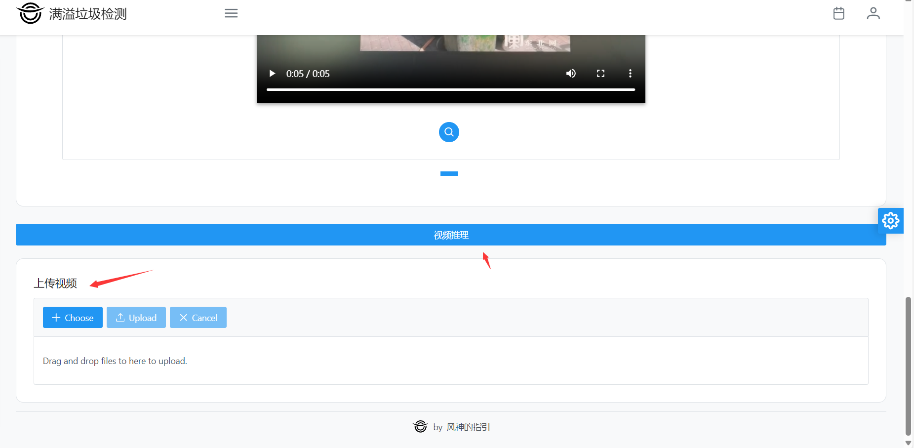

# 实验报告3- 模型推理服务部署

> 本次的模型推理服务部署中，服务器采用的是阿里云的轻量应用服务器，操作系统为CenOS 7.6。前端使用vite+vue3工具链，在本地部署验证通过后生成项目部署到服务器上，使用nginx进行反向代理。后端使用flask框架，部署在服务器上。
> 
> 我们在页面上进行了部分模型的介绍，同样我们也提供了可供选择的模型，用户可以选择自己需要的模型进行推理。我们提供了上传图片的功能，用户可以上传自己的图片进行推理，同时我们也提供了默认的图片供用户选择。用户上传图片后，我们会将图片上传到服务器上，然后进行推理，最后将推理结果返回给用户。
> 
> 此外我们还提供了上传视频的功能，用户可以上传自己的视频进行推理，我们会将视频上传到服务器上，然后进行推理，最后将推理完成的视频返回给用户，供用户下载。我们还提供了默认的视频供用户选择。用户上传视频后，我们会将视频上传到服务器上，然后进行推理，最后将推理完成的视频返回给用户。
> 
> 整体自由度较高，但是考虑到使用的是CPU服务器，所以做视频推理需要耗费较长时间。建议视频时长不要超过5s。那样的话，选择Picodet推理时长大概在1min以内。
> 
> 我们还提供了网页模式选择，风格调整的功能，用户可以根据自己的喜好选择自己喜欢的风格。
>


<!-- TOC -->

- [实验报告3- 模型推理服务部署](#实验报告3--模型推理服务部署)
  - [服务器部署（CentOS 7.6）](#服务器部署centos-76)
    - [环境配置](#环境配置)
      - [一键安装nginx](#一键安装nginx)
      - [配置Nginx](#配置nginx)
      - [一键安装Anaconda(python3.9.13)](#一键安装anacondapython3913)
      - [安装PaddlePaddle](#安装paddlepaddle)
    - [模型导出及部署（以Picodet-xs为例）](#模型导出及部署以picodet-xs为例)
      - [模型导出](#模型导出)
      - [模型部署](#模型部署)
          - [模型图片推理部署](#模型图片推理部署)
          - [模型视频推理部署](#模型视频推理部署)
  - [网页使用介绍](#网页使用介绍)
    - [总览](#总览)
    - [网页模式选择，风格调整](#网页模式选择风格调整)
    - [Home部分](#home部分)
    - [Model部分](#model部分)
      - [Video](#video)
      - [Image](#image)

<!-- /TOC -->
## 服务器部署（CentOS 7.6）


### 环境配置

#### 一键安装nginx

path:`/root`

```shell
mkdir tmp && cd /root/tmp && yum install -y make cmake gcc gcc-c++ pcre pcre-devel zlib zlib-devel openssl openssl-devel && wget https://nginx.org/download/nginx-1.22.1.tar.gz && tar -zxvf nginx-1.22.1.tar.gz && cd nginx-1.22.1/ && ./configure --prefix=/usr/local/nginx --with-http_stub_status_module --with-http_ssl_module --with-file-aio --with-http_realip_module && make && make install && ln -s /usr/local/nginx/sbin/nginx /usr/bin/nginx
```


#### 配置Nginx

```sh
cd /usr/local/nginx/conf
vim nginx.conf
```


```conf
/root/dev-front/dist
```


```conf
 server {
        listen       8888;
        server_name  localhost;	
		location /images/ {
		root /root/dev-back/PaddleDetection/dataset/datasets_coco;
			autoindex on;
			add_header Access-Control-Allow-Origin *;
			add_header Access-Control-Allow-Headers X-Requested-With;
			add_header Access-Control-Allow-Methods GET,POST,OPTIONS;
		}
		location /static/ {
            alias /root/dev-back;
            autoindex on;
             charset utf-8;
        }
    }
    server {
        listen       8877;
        server_name  localhost;	
		location /static/ {
		root /root/dev-back/;
			autoindex on;
			add_header Access-Control-Allow-Origin *;
			add_header Access-Control-Allow-Headers X-Requested-With;
			add_header Access-Control-Allow-Methods GET,POST,OPTIONS;
		}
    }
```


#### 一键安装Anaconda(python3.9.13)

path:`/root`

```sh
cd /root/tmp && wget https://repo.anaconda.com/archive/Anaconda3-2022.10-Linux-x86_64.sh && bash Anaconda3-2022.10-Linux-x86_64.sh && bash Anaconda3-2022.10-Linux-x86_64.sh
```

```sh
source ~/.bashrc
```

#### 安装PaddlePaddle

[PaddleDetection/docs/tutorials/INSTALL_cn.md at release/2.6 · PaddlePaddle/PaddleDetection (github.com)](https://github.com/PaddlePaddle/PaddleDetection/blob/release/2.6/docs/tutorials/INSTALL_cn.md)

1. 安装PaddlePaddle

```sh
# CPU
python -m pip install paddlepaddle==2.3.2 -i https://mirror.baidu.com/pypi/simple
```

请确保您的PaddlePaddle安装成功并且版本不低于需求版本。使用以下命令进行验证。

```
# 在您的Python解释器中确认PaddlePaddle安装成功
>>> import paddle
>>> paddle.utils.run_check()

# 确认PaddlePaddle版本
python -c "import paddle; print(paddle.__version__)"
```

2. 安装PaddleDetection

**注意：** pip安装方式只支持Python3

```
yum install -y git
# 克隆PaddleDetection仓库
cd <path/to/clone/PaddleDetection>
git clone https://gitee.com/PaddlePaddle/PaddleDetection.git

# 安装其他依赖
cd PaddleDetection
pip install -r requirements.txt

# 编译安装paddledet
python setup.py install
pip install opencv-python-headless
```


### 模型导出及部署（以Picodet-xs为例）

#### 模型导出

更多导出细节请参考PaddleDetection官方文档选择对应模型进行查看：[PaddleDetection (gitee.com)](https://gitee.com/paddlepaddle/PaddleDetection/tree/release/2.6)

- 模型导出

```sh
python tools/export_model.py -c configs/picodet/picodet_xs_416_coco_lcnet.yml -o weights=output/picodet_xs_416_coco_lcnet/model_best_picodet.pdparams export.nms=False export.benchmark=True --output_dir=output_inference
```
最终导出的模型可以在output_dir中找到。


#### 模型部署

###### 模型图片推理部署

```sh
# Picodet-xs
python deploy/python/infer.py --model_dir=./output_inference/picodet_xs_416_coco_lcnet --image_file=./dataset/datasets_coco/images/000001.jpg --device=CPU --save_images=True --save_results --output_dir=./output-infer/Picodet-xs
```


###### 模型视频推理部署

```sh
# Picodet-xs
python deploy/python/infer.py --model_dir=./output_inference/picodet_xs_416_coco_lcnet --video_file=./test1.mp4 --device=CPU --save_results --output_dir=./output-video-infer/Picodet-xs
```

具体的服务器部署细节可参考后端代码[main.py](../../code/dev-back/main.py)。


## 网页使用介绍


- 网页模式选择，风格调整
- Home部分
- Model部分


### 总览

> 点击 **右侧的齿轮** 按钮可进行页面风格的切换以及页面大小的调整。
> 
> 点击 **左上方的三条横线** 可以展示/关闭左侧的导航栏。
>
> **Home部分** 为链接可通过点击跳转。分别为Bilibili视频介绍链接，Github链接，以及Gitee链接。
>
> **Model部分** 为模型推理部分，分别为Video视频推理部分以及Image图片推理部分。
>


### 网页模式选择，风格调整


通过 **Scale** 部分的调整可以调整页面显示，总共有5档可供选择。

通过 **Menu Type** 部分的调整可以调整页面风格，总共有Static 和 Overlay 2种风格供选择。

通过 **Theme** 部分的调整可以调整页面主题，总共有12种风格可供选择。


### Home部分

Home部分均为链接可通过点击跳转。分别为Bilibili视频介绍链接，Github链接，以及Gitee链接。

### Model部分

Model部分为模型推理部分，分别为Video视频推理部分以及Image图片推理部分。

#### Video

video部分为视频推理部分，用户可以上传自己的视频进行推理，我们会将视频上传到服务器上，然后进行推理，最后将推理完成的视频返回给用户，供用户下载。

从上往下依次是模型介绍，模型选择，视频样例，视频推理以及上传视频。

**模型介绍**

模型介绍部分列出了部分模型的参数以及简单的介绍，具体细节可以点击左侧Github/Gitee链接进行查看


**模型选择**

在模型选择上我们提供了十多种可供选择的推理模型，用户可以选择自己需要的模型进行推理。


**视频样例**

在视频样例部分我们提供了一个5秒的视频，用户可以点击播放按钮进行播放查看。
点击放大镜按钮即可对样例视频进行推理，推理完成后会返回推理后的视频供用户下载。


**上传视频及视频推理**

用户也可以先选择自己的视频进行上传推理。具体步骤如下：

1.点击Choose 按钮选择要进行推理的mp4格式的视频文件

2.点击Upload按钮上传视频

3.等待上传完成，点击视频推理

4.等待推理完成，服务器返回推理后的视频




#### Image

Image部分为图片推理部分，用户可以上传自己的图片进行推理，我们会将图片上传到服务器上，然后进行推理，最后将推理结果返回给用户。

从上往下依次是模型选择，图片样例，结果，图片推理以及上传图片。


**模型选择**

在模型选择上我们提供了十多种可供选择的推理模型，用户可以选择自己需要的模型进行推理。


**图片样例**

在图片样例部分我们提供了一张图片。

点击放大镜按钮即可对样例图片进行推理，推理完成后会返回推理后的图片，并在Result部分返回推理产生的json数据。


**上传图片及图片推理**

用户也可以先选择自己的图片进行上传推理。具体步骤如下：

1.点击Choose 按钮选择要进行推理的'jpg','png','jpeg','bmp','.webp'等格式的图片文件

2.点击Upload按钮上传图片

3.等待上传完成，点击开始推理

4.等待推理完成，服务器返回推理后的图片以及json数据


